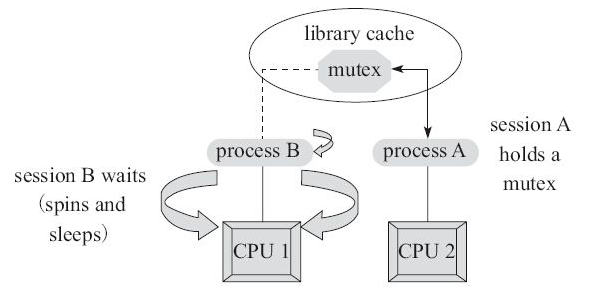

要想说明白锁优化，先回顾一下 `POSIX 锁`和 `Java-synchronized` 原理

# Mutex Lock 复习

Java-Monitor 本质是依赖于底层的操作系统的 Mutex Lock 来实现的。每个对象都对应于一个可称为“互斥锁” 的“标记”，这个标记用来保证在任一时刻，只能有一个线程访问该对象。

互斥锁用于保护临界区，确保同一时间只有一个线程访问数据。互斥锁可以通过互斥量实现：对共享资源的访问，先对互斥量进行加锁，如果互斥量已经上锁，调用线程会阻塞，直到互斥量被解锁。在完成了对共享资源的访问后，要对互斥量进行解锁。、

> Mutex Lock 的相关可参见 《[APUE ———— Stevens](https://book.douban.com/subject/1788421/)》 或者 《[Linux系统编程 ———— Robert Love](https://book.douban.com/subject/3907181/)》。
> 前者虽然是无法超越的经典，但是个人推荐后者。因为后者重点突出，该讲的都讲了。

## 锁的语义

### 锁的内存语义

*   内存可见性：(由两条规则保证)

1.  如果对一个变量执行lock操作，将会清空工作内存中此变量的值，在执行引擎使用这个变量前需要重新执行 load 或 assign 操作初始化变量的值；

    > 这一点保证了：当线程获取锁时，JVM 会把该线程对应的本地内存置为无效。从而使得被监视器保护的临界区代码必须从主内存中读取共享变量

2.  如果对一个变量执行 unlock 操作，必须先把此变量同步回主内存中（执行 store 和 write 操作）。

    > 当线程释放锁时，JVM 会把该线程对应的本地内存中的共享变量刷新到主内存中

*   操作原子性：持有同一个锁的两个同步块只能串行地进入(互斥的意思)

### 锁的线程语义

1.  线程 A 释放一个锁，实质上是线程 A 向接下来将要获取这个锁的某个线程发出了（线程 A 对共享变量所做修改的）消息；

2.  线程 B 获取一个锁，实质上是线程 B 接收了之前某个线程发出的（在释放这个锁之前对共享变量所做修改的）消息；

3.  线程 A 释放锁，随后线程 B 获取这个锁，这个过程实质上是线程 A 通过主内存向线程 B 发送消息。

## mutex的工作方式

1.  申请 mutex；

2.  如果成功，则持有该 mutex；

3.  如果失败，则进行 spin ； spin 的过程就是在线等待 mutex, 不断发起 mutex gets, 直到获得mutex 或者达到 spin_count 限制为止；

4.  依据工作模式的不同选择 yiled 还是 sleep；

5.  若达到 sleep 限制或者被主动唤醒或者完成 yield , 则重复 1~4 步，直到获得为止。

# synchronized 复习

synchronized 的底层是使用操作系统的 `mutex lock` 实现的。

由于 Java 的线程是映射到操作系统的原生线程之上的，如果要阻塞或唤醒一条线程，都需要操作系统来帮忙完成，这就需要从用户态转换到核心态中，因此状态转换需要耗费很多的处理器时间。

所以 synchronized 是  Java语言中的一个重量级操作。在 JDK1.6 中，虚拟机进行了一些优化，譬如在通知操作系统阻塞线程之前加入一段自旋等待过程，避免频繁地切入到核心态中。

synchronized 影响性能的原因有两点：

1.  加锁解锁操作需要额外操作；

2.  互斥同步对性能最大的影响是阻塞的实现，因为阻塞涉及到的挂起线程和恢复线程的操作都需要转入内核态中完成（用户态与内核态切换的性能代价较大）。

synchronized 与 java.util.concurrent 包中的 ReentrantLock 相比，由于 JDK1.6 中加入了针对锁的优化措施，使得  synchronized与 ReentrantLock 的性能基本持平。ReentrantLock 只是提供了 synchronized 更丰富的功能，而不一定有更优的性能，所以在 synchronized 能实现需求的情况下，优先考虑使用 synchronized 来进行同步。

> 具体参见《[深入理解 Java 虚拟机 ———— 周志明](https://book.douban.com/subject/24722612/)》

## Java 对象头

在运行期间，Mark Word 里存储的数据会随着锁标志位的变化而变化，以 32 位的 JDK 为例：

# Java 锁优化

synchronized 是依赖于底层的操作系统的 Mutex Lock 来实现的，而操作系统实现线程之间的切换需要从用户态转换到核心态，这个成本非常高，状态之间的转换需要相对比较长的时间，这就是为什么synchronized 效率低的原因。因此，这种依赖于操作系统 Mutex Lock 所实现的锁我们称之为“重量级锁”。

JDK1.6 为了减少获得锁和释放锁带来的性能消耗，引入了“偏向锁”和“轻量级锁”：锁一共有4种状态，锁可以升级但不能降级，级别从低到高依次是：

*   无锁

*   偏向锁

*   轻量级锁

*   重量级锁

> 从某种意义上说，偏向锁、轻量级锁都是乐观锁，重量级锁是悲观锁。

## 偏向锁

### 偏向锁概述

#### 前提

HotSpot 的作者经过研究发现，大多数情况下，锁不仅不存在多线程竞争，而且总是由同一线程多次获得。**偏向锁是为了在只有一个线程执行同步块时提高性能**。

#### 过程

1.  一个对象刚开始实例化的时候，没有任何线程来访问它的时候。这意味着，它现在认为只可能有一个线程来访问它，所以当第一个线程来访问它的时候，它会“偏向”这个线程，此时，对象持有偏向锁。偏向第一个线程，这个线程在修改对象头成为偏向锁的时候使用 CAS 操作，并将对象头中的 ThreadID 改成自己的ID，之后再次访问这个对象时，只需要对比 ID，不需要再使用 CAS 在进行操作。

    > 简而言之就是：当一个线程访问同步块并获取锁时，会在对象头和栈帧中的锁记录里存储锁偏向的线程 ID，以后该线程在进入和退出同步块时不需要进行 CAS 操作来加锁和解锁，只需简单地测试一下对象头的 Mark Word 里是否存储着指向当前线程的偏向锁。

2.  一旦有第二个线程访问这个对象，因为偏向锁不会主动释放，所以第二个线程可以看到对象时偏向状态，这时表明在这个对象上已经存在竞争了，则检查原来持有该对象锁的线程是否依然存活：

1.  如果原来的线程未存活了，则可以将对象变为无锁状态，然后重新偏向新的线程；

2.  如果原来的线程依然存活，则马上执行那个线程的操作栈，检查该对象的使用情况：

1.  如果仍然需要持有偏向锁，则偏向锁升级为轻量级锁，（偏向锁就是这个时候升级为轻量级锁的）。

2.  如果不存在使用了，则可以将对象回复成无锁状态，然后重新偏向。

#### 原理

引入偏向锁是为了在**无多线程竞争**的情况下**尽量减少不必要的轻量级锁执行路径**，因为轻量级锁的获取及释放依赖多次 CAS 原子指令，而偏向锁只需要在置换 ThreadID 的时候依赖一次 CAS 原子指令（由于一旦出现多线程竞争的情况就必须撤销偏向锁，所以偏向锁的撤销操作的性能损耗必须小于节省下来的 CAS 原子指令的性能消耗）。

### 偏向锁加锁过程

1.  访问 Mark Word 中偏向锁的标识是否设置成 1、锁标志位是否为 01 —— 确认为可偏向状态。

2.  如果为可偏向状态，则测试线程 ID 是否指向当前线程，如果是，进入步骤（5），否则进入步骤（3）。

3.  如果线程 ID 并未指向当前线程，则通过 CAS 操作竞争锁。如果竞争成功，则将 Mark Word 中线程 ID 设置为当前线程 ID，然后执行（5）；如果竞争失败，执行（4）。

4.  如果 CAS 获取偏向锁失败，则表示有竞争（ CAS 获取偏向锁失败说明至少有过其他线程曾经获得过偏向锁，因为线程不会主动去释放偏向锁）。当到达全局安全点（safepoint）时，会首先暂停拥有偏向锁的线程，然后检查持有偏向锁的线程是否活着（因为可能持有偏向锁的线程已经执行完毕，但是该线程并不会主动去释放偏向锁），如果线程不处于活动状态，则将对象头设置成无锁状态（标志位为“01”），然后重新偏向新的线程；如果线程仍然活着，撤销偏向锁后升级到轻量级锁状态（标志位为“00”），此时轻量级锁由原持有偏向锁的线程持有，继续执行其同步代码，而正在竞争的线程会进入自旋等待获得该轻量级锁。

5.  执行同步代码。

### 偏向锁的释放过程

如上步骤（4）。

偏向锁使用了一种等到竞争出现才释放偏向锁的机制：偏向锁只有遇到其他线程尝试竞争偏向锁时，持有偏向锁的线程才会释放锁，线程不会主动去释放偏向锁。偏向锁的撤销，需要等待全局安全点（在这个时间点上没有字节码正在执行），它会首先暂停拥有偏向锁的线程，判断锁对象是否处于被锁定状态，撤销偏向锁后恢复到未锁定（标志位为“01”）或轻量级锁（标志位为“00”）的状态。

### 偏向锁开关

偏向锁在 JDK1.6 及以上是默认启用的。由于偏向锁是为了在只有一个线程执行同步块时提高性能，如果确定应用程序里所有的锁通常情况下处于竞争状态，可以通过 JVM 参数关闭偏向锁：-XX:-UseBiasedLocking=false，那么程序默认会进入轻量级锁状态。

## 轻量级锁

### 轻量级锁概述

轻量级锁是为了在线程近乎交替执行同步块时提高性能。

轻量级锁认为竞争存在，但是竞争的程度很轻，一般两个线程对于同一个锁的操作都会错开，或者说稍微等待一下（自旋），另一个线程就会释放锁。

但是当自旋超过一定的次数，或者一个线程在持有锁，一个在自旋，又有第三个来访时，**轻量级锁膨胀为重量级锁**，重量级锁使除了拥有锁的线程以外的线程都阻塞，防止 CPU 空转。

### 轻量级锁加锁过程

1.  在代码进入同步块的时候，如果同步对象锁状态为无锁状态（锁标志位为“01”状态，是否为偏向锁为“0”），虚拟机首先将在当前线程的栈帧中建立一个名为锁记录（Lock Record）的空间，用于存储锁对象目前的 Mark Word 的拷贝，官方称之为 `Displaced Mark Word`。这时候线程堆栈与对象头的状态如下图所示。

2.  拷贝对象头中的Mark Word复制到锁记录中。

3.  拷贝成功后，虚拟机将使用 CAS 操作尝试将对象的 Mark Word 更新为指向 Lock Record 的指针，并将 Lock record 里的 owner 指针指向 object mark word。如果更新成功，则执行步骤（4），否则执行步骤（5）。

4.  如果这个更新动作成功了，那么这个线程就拥有了该对象的锁，并且对象 Mark Word 的锁标志位设置为“00”，即表示此对象处于轻量级锁定状态，这时候线程堆栈与对象头的状态如下图所示。

5.  如果这个更新操作失败了，虚拟机首先会检查对象的 Mark Word 是否指向当前线程的栈帧，如果是就说明当前线程已经拥有了这个对象的锁，那就可以直接进入同步块继续执行。否则说明多个线程竞争锁，若当前只有一个等待线程，则可通过自旋稍微等待一下，可能另一个线程很快就会释放锁。 但是当自旋超过一定的次数，或者一个线程在持有锁，一个在自旋，又有第三个来访时，**轻量级锁膨胀为重量级锁**，重量级锁使除了拥有锁的线程以外的线程都阻塞，防止 CPU 空转，锁标志的状态值变为“10”，Mark Word 中存储的就是指向重量级锁（互斥量）的指针，后面等待锁的线程也要进入阻塞状态。

### 轻量级锁释放过程：

1.  通过 CAS 操作尝试把线程中复制的 Displaced Mark Word 对象替换当前的 Mark Word。

2.  如果替换成功，整个同步过程就完成了。

3.  如果替换失败，说明有其他线程尝试过获取该锁（此时锁已膨胀），那就要在释放锁的同时，唤醒被挂起的线程。

## 重量级锁

如上轻量级锁的加锁过程步骤（5），轻量级锁所适应的场景是线程近乎交替执行同步块的情况，如果存在同一时间访问同一锁的情况，就会导致轻量级锁膨胀为重量级锁。Mark Word 的锁标记位更新为 10，Mark Word 指向互斥量（重量级锁）

再回顾前面一直提到的一句话：“synchronized 的重量级锁是通过对象内部的一个叫做监视器锁（monitor）来实现的，监视器锁本质又是依赖于底层的操作系统的Mutex Lock（互斥锁）来实现的。而操作系统实现线程之间的切换需要从用户态转换到核心态，这个成本非常高，状态之间的转换需要相对比较长的时间”。这就是为什么未优化的 synchronized 效率低的原因。

# 总结：偏向锁/轻量级锁/重量级锁之间的转换

1.  一个对象刚开始实例化的时候，没有任何线程来访问它的时候。它是可偏向的，意味着，它现在认为只可能有一个线程来访问它，所以当第一个线程来访问它的时候，它会偏向这个线程，此时，对象持有偏向锁。偏向第一个线程，这个线程在修改对象头成为偏向锁的时候使用 CAS 操作，并将对象头中的 ThreadID  改成自己的 ID，之后再次访问这个对象时，只需要对比 ID，不需要再使用 CAS 在进行操作。

2.  一旦有第二个线程访问这个对象，因为偏向锁不会主动释放，所以第二个线程可以看到对象时偏向状态，这时表明在这个对象上已经存在竞争了。检查原来持有该对象锁的线程是否依然存活，如果挂了，则可以将对象变为无锁状态，然后重新偏向新的线程。如果原来的线程依然存活，则马上执行那个线程的操作栈，检查该对象的使用情况，如果仍然需要持有偏向锁，则偏向锁升级为轻量级锁，（**偏向锁就是这个时候升级为轻量级锁的**），此时轻量级锁由原持有偏向锁的线程持有，继续执行其同步代码，而正在竞争的线程会进入自旋等待获得该轻量级锁；如果不存在使用了，则可以将对象回复成无锁状态，然后重新偏向。

3.  轻量级锁认为竞争存在，但是竞争的程度很轻，一般两个线程对于同一个锁的操作都会错开，或者说稍微等待一下（自旋），另一个线程就会释放锁。 但是当自旋超过一定的次数，或者一个线程在持有锁，一个在自旋，又有第三个来访时，**轻量级锁膨胀为重量级锁**，重量级锁使除了拥有锁的线程以外的线程都阻塞，防止CPU空转。

# 通俗理解

以上厕所为例。

如果是一个人在家的话，如果需要上厕所，那么其实只要关上大门就好了，没人会来抢上厕所，因此不用关上主卫门。这就是**偏向锁**。

如果家里有人，就不能这么做了，因为其他人可能会来抢厕所，这就是多个线程交替获取锁的情况。

那这个时候又要怎么做呢？比如说你老婆正在上厕所了，你也想上厕所，你猜你老婆正在小便，上厕所的时间应该不会太久，于是你就在厕所门口等一会（自旋）。以前 synchronized 的方案就是让你回房间躺着等（阻塞），可能回房间的时间都比你撒尿的时间长（挂起线程的时间比执行同步方法中的时间还要长的情况）。这就是**轻量级锁**。

接着上面的假设，当你等的有点久了，你会觉得你老婆可能这次在蹲大号，需要的时间较长，所以你就回房间等了（阻塞），这时候就从轻量级锁升级到**重量级锁**了。

# 其他锁优化

## 锁消除

删除不必要的加锁操作，即如果根据代码逃逸技术，判断到一段代码中，堆上的数据不会逃逸出当前线程，那么可以认为这段代码是线程安全的，不必要加锁。

## 锁粗化

如果虚拟机检测到有一串零碎的操作都是对同一对象的加锁，将会把加锁同步的范围扩展（粗化）到整个操作序列的外部。

## 自旋锁与自适应自旋锁

### 引入自旋锁的原因

互斥同步对性能最大的影响是阻塞的实现，因为挂起线程和恢复线程的操作都需要转入内核态中完成，这些操作给系统的并发性能带来很大的压力。同时虚拟机的开发团队也注意到在许多应用上面，共享数据的锁定状态只会持续很短一段时间，为了这一段很短的时间频繁地阻塞和唤醒线程是非常不值得的。

因此引入自旋锁。

### 自旋锁

让该线程执行一段无意义的忙循环（自旋）等待一段时间，不会被立即挂起（自旋不放弃处理器额执行时间），看持有锁的线程是否会很快释放锁。

自旋锁在 JDK 1.4.2 中引入，默认关闭，但是可以使用 -XX:+UseSpinning 开开启；在 JDK1.6 及以上默认开启。

### 自旋锁的缺点

自旋等待不能替代阻塞，虽然它可以避免线程切换带来的开销，但是它占用了处理器的时间：如果持有锁的线程很快就释放了锁，那么自旋的效率就非常好；反之，自旋的线程就会白白消耗掉处理器的资源，它不会做任何有意义的工作，这样反而会带来性能上的浪费。

所以说，自旋等待的时间（自旋的次数）必须要有一个限度，例如让其循环 10 次，如果自旋超过了定义的时间仍然没有获取到锁，则应该被挂起（进入阻塞状态）。

通过参数 -XX:PreBlockSpin 可以调整自旋次数，默认的自旋次数为 10。

### 自适应的自旋锁

JDK1.6 引入自适应的自旋锁，自适应就意味着自旋的次数不再是固定的，它是由前一次在同一个锁上的自旋时间及锁的拥有者的状态来决定：

1.  如果在同一个锁的对象上，自旋等待刚刚成功获得过锁，并且持有锁的线程正在运行中，那么虚拟机就会认为这次自旋也很有可能再次成功，进而它将允许自旋等待持续相对更长的时间；

2.  如果对于某个锁，自旋很少成功获得过，那在以后要获取这个锁时将可能省略掉自旋过程，以避免浪费处理器资源。

简单来说，就是线程如果自旋成功了，则下次自旋的次数会更多；如果自旋失败了，则自旋的次数就会减少。

### 自旋锁使用场景

从轻量级锁获取的流程中我们知道，当线程在获取轻量级锁的过程中执行 CAS 操作失败时，是要通过自旋来获取重量级锁的。（见前面“轻量级锁”）
