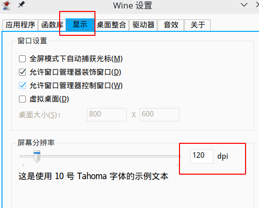

# 应用中无法输入中文

通过 yay 安装好微信后无法输入中文, 问题的表现是中文输入法比如搜狗拼音或谷歌拼音输入法的框无法唤起，那么问题就出在输入法的框上，也就是 fcitx 上。
这里以微信为例，找到如下路径 `/opt/deepinwine/apps/Deepin-WeChat`（其他 wine 应用同理），找到路径下的 `run.sh` 文件，在魔法注释下方添加如下代码，
`export GTK_IM_MODULE=fcitx`
`export QT_IM_MODULE=fcitx`
`export XMODIFIERS="@im=fcitx"`
重启电脑即可。

> 如果还发现搜狗不能用，可以试试谷歌拼音。它两者的 fcitx 似乎还不同，搜狗拼音是 fcitx-qt，谷歌拼音不知道是啥。

> 如果遇到其他应用无法输入中文，例如 wps 等，也可以应用这种方法解决。wps 是分别在 /usr/bin/wps、/usr/bin/wpp、/usr/bin/et 这三个文件中添加上述三行代码。

# 高分屏支持

我这里是 1920 × 1080，这下面如果采用默认的缩放配置，字体太小了。kde 桌面是通过固定字体的 DPI 来适配高分屏的。我这里是 1920 × 1080 分辨率，默认是 96 DPI，我想着是 125% 缩放， 96 * 1.25 = 120，所以这里设置成了 120，用起来也挺好的，很舒服了。设置的地方如下，在 `系统设置 -> 字体` 中，

这里只能修改原生应用，如果是 wine 应用例如微信，就还是原来的缩放。对于 wine 应用，设置的方法如下，终端执行 `env WINEPREFIX="$HOME/.deepinwine/Deepin-WeChat" winecfg`，按照下图设置，

> 设置值同上文所述，默认是 96，缩放 125%，96 * 1.25 = 120，所以这里设置成了 120。

> 目前测试下来，wine-wechat 这样做可以，但是 wine 版迅雷却不行，原因未知，待找到办法后再来补充。

# 查看本机 ip

直接安装下来什么都不装的话，可以发现没有 ipconfig 这个命令，`sudo pacman -S net-tools`，安装完即可执行 ipconfig。

如果实在不想装，可以执行 `ip address`，也可以查看到 ip 地址。

# 关闭选区自动复制

默认配置下，只要拖拉光标选择一些字符，就会被自动复制到系统的剪贴板上。解决办法就是，`状态栏剪贴板右键 -> 配置剪贴板 -> 常规 -> 勾选[忽略选区]`。

# 开启ssh服务

`systemctl enable sshd.service # SSH 服务随着开机自启动`
`systemctl start sshd.service # 立即启动 SSH 服务`
`systemctl restart sshd.service # 立即重启 SSH 服务`
