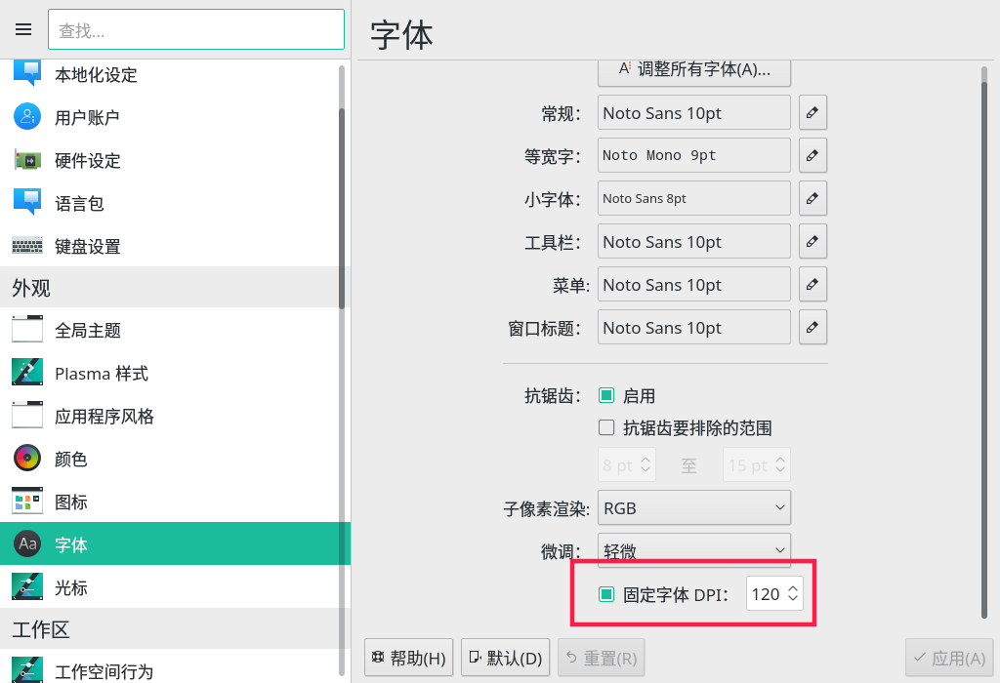
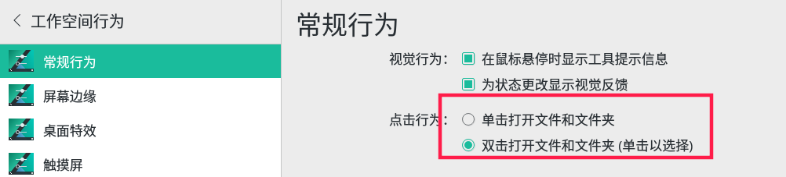
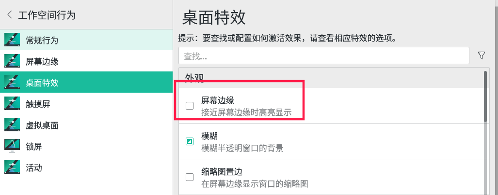
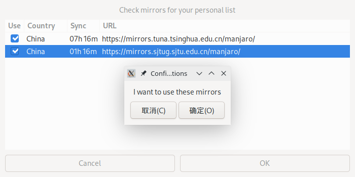
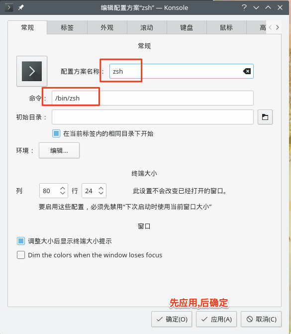

# 系统安装

镜像版本：manjaro-kde-18.1.5-191229-linux54。安装过程非常好装，不需要借助教程，不赘述了。

# 系统级别的一些 better-defaults 配置

## 调整高分屏的缩放

kde 桌面是通过固定字体的 DPI 来适配高分屏的。我这里是 1920 * 1080 分辨率，默认是 96 DPI，我想着是 125% 缩放， 96 * 1.25 = 120，所以这里设置成了 120，用起来也挺好的，很舒服了。设置的地方如下，


## 设置双击打开文件

默认是单击打开，而我们的习惯一般是双击打卡。`系统设置 -> 工作空间行为 -> 常规行为`，在这里设置，


## 取消边缘贴靠特效

先来张示意图，如果设置了面板自动隐藏，那么快触达隐藏面板时，会有一层阴影，如下图所示，

个人觉得这个阴影非常丑。我个人期望的是，隐藏的面板要么不出来，要么一下子出来，不要在中间状态出现这个阴影。那么设置的地方如下，把“屏幕边缘”的勾选去掉即可，



# 安装软件
## 简单描述下 manjaro 安装软件的原理
不得不提一下包管理系统。pacman 对于 manjaro，类似 Ubuntu 的 apt-get、mac 的 homebrew 等。pacman 可以先理解为 manjaro 的包管理系统（其实严谨的说法应该是，pacman 及其远端包仓库等共同构成了包管理系统，也可以理解成 pacman 是 manjaro 官方仓库的 client 端（server/client 架构））。

manjaro 中的 pacman 只能管理和安装 Manjaro 官方仓库中的软件，这个仓库是有专人管理的，也有审核，质量较高，但是软件数目小于 AUR。

AUR 仓库是一个社区维护的仓库，基本上是人人都可以上传他的源代码，因此鱼龙混杂，软件数目比 manjaro 官方仓库多得多，基本上 Linux 上的软件这里面都有。这个仓库中的软件需要使用 aur 客户端（例如 yay 或者 yaourt 等）来安装。

所以安装软件的原则是：如果 manjaro 官方库（pacman）里面有，则优先 pacman 安装；如果需要的软件在 manjaro 官方仓库中没有，那么再选择 aur 仓库安装（使用 yay 或者 yaourt 等）。

> yaourt 已废弃，推荐使用 yay。

## 设置源
如上一节介绍，manjaro 有官方源，但是它由于基于 archlinux，因此 arch 的源它自然也是可以使用的。所以这一节的标题“设置源”，就分为三部分：一个是设置 manjaro 自己的官方的源，一个是设置 archlinux 的源，另一个是 aur 的源。

### 设置官方源（core，extra，community，multilib）
#### 方式一
`sudo pacman-mirrors -i -c China -m rank   // 更新镜像排名`

如下图所示，将上交和清华的源都选上，点击确定，


`sudo pacman -Syy  // 同步软件包数据库`

#### 方式二
也可以手动添加配置，`sudo vim /etc/pacman.d/mirrorlist`

```
# 添加 manjaro 稳定源
## 中科大
Server = https://mirrors.ustc.edu.cn/manjaro/stable/$repo/$arch
## 清华大学
Server = https://mirrors.tuna.tsinghua.edu.cn/manjaro/stable/$repo/$arch
## 上海交通大学
Server = https://mirrors.sjtug.sjtu.edu.cn/manjaro/stable/$repo/$arch
## 浙江大学
Server = https://mirrors.zju.edu.cn/manjaro/stable/$repo/$arch
```

#### 方式三
该方式需要了解几个配置文件，
1. `/etc/pacman-mirrors.conf`：可以在里面指定只添加中国的源，其镜像地址最终会写入 `/etc/pacman.d/mirrorlist` 中。
2. `/etc/pacman-conf`：可以在此添加 archlinuxcn 源的地方。
3. `/etc/pacman.d/mirrorlist`：可以在此配置文件中自行添加源，从上到下优先级依次降低。

那么方式三的执行步骤为，
1. 在配置文件 1 中添加 `OnlyCountry=China`
2. 执行 `sudo pacman-mirrors -g`，该步会打印执行日志，可以看到符合条件的镜像会 **覆盖写入** 到配置文件 3 中。

其实方式一到方式三中，最为推荐的还是该方法。

### 设置 archlinuxcn 源（中科大  or 清华都可以）

`/etc/pacman.conf` 文件末尾添加如下代码，这里添加的是清华的镜像。

```
[archlinuxcn]
SigLevel = Optional TrustedOnly
Server = https://mirrors.tuna.tsinghua.edu.cn/archlinuxcn/$arch
```

修改好之后在命令行执行如下代码，
`sudo pacman -Syyu  // 更新数据源和系统软件`
`sudo pacman -S archlinuxcn-keyring // 安装导入GPG key`

### 设置 aur 源（中科大  or 清华都可以）
注：aur 源安装还是谨慎为好。archlinuxcn 上的包有他们的维护人员审核，稳定性（防止滚挂）和安全性（防止恶意软件）有一定的保障，而 AUR 是任何人都可以注册并上传东西的。并且 2018 年还爆出在 AUR 中发现恶意软件。

但是在 archlinuxcn 也不是百分百安全，因为在 pacman.conf 添加 archlinuxcn 源后，可以搜到很多 AUR 包。当然这些包不一定与 AUR 一致，也有可能一致。

最好的就是安装较热门或者使用人数相对较多的软件，尽量少使用偏门软件。

安装 aur 需要先安装 aur 助手，aur 助手与 aur 的关系，就像 client 端和 server 端的关系。

aur 助手常见的有 yaourt/yay 等，目前（2019 年 2 月），yay 算是最优选择，其他一些已经废弃。

yay 的话先安装 yay，执行 `yay --aururl “https://aur.tuna.tsinghua.edu.cn” --save` 命令修改 aururl，修改 ` ~/.config/yay/config.json`，`yay -P -g` 查看配置。

yaourt 的话也是先安装 yaourt，修改 `/etc/yaourtrc` 配置文件，打开 `# AURURL` 的注释,并修改为 `AURURL="https://aur.tuna.tsinghua.edu.cn"`。


## 安装搜狗输入法

### 一般教程及报错解决

一般的教程步骤如下，
`sudo pacman -S fcitx-im     # 全部安装`
`sudo pacman -S fcitx-configtool     # 图形化配置工具`
`sudo pacman -S fcitx-sogoupinyin # 搜狗输入法` 

修改 `vim ~/.xprofile`，如果没有该文件则新建，添加如下内容，然后重启，
`export GTK_IM_MODULE=fcitx`
`export QT_IM_MODULE=fcitx`
`export XMODIFIERS="@im=fcitx"`

我这里重启后提示错误，`搜狗输入法异常！请删除 .config/SogouPY 并重启`，将 `.config/SogouPY` 删除后也不顶用。后来在终端中输入 `sogou-qimpanel`，提示找不到 `libfcitx-qt.so`。因此原因就明确了，安装 `fcitx-qt4` 就可以成功解决上述问题，即 `sudo pacman -S fcitx-qt4`，一路往下进行流程即可。

> 如果懒得折腾搜狗，或者搜狗安装报错没办法搞定，可以试试谷歌拼音，也很好用的。安装完 `fcitx-im` 和 `fcitx-configtool` 之后，执行`sudo pacman -S fcitx-googlepinyin # 谷歌拼音输入法`，接着配置 `./xprofile` 即可。方法都如前所述。

有些 KDE 内置应用无法输入中文，`sudo pacman -S kcm-tcitx` 即可。

## 如果是 vmware 安装

先正常安装，一般会默认装好 vmtools。如果 vmtools 没装好，也可以自行手动安装，
`sudo pacman -S open-vm-tools`
`sudo pacman -S gtkmm3`
`sudo reboot`

但是装好后会发现，这样操作下来仅限于从主机和虚拟机之间复制粘贴一些文本内容，如果想复制粘贴一个文件，则还是不行。

网上查到的方法普遍都是如上，甚至官网的文档也是这样介绍的，详见 https://wiki.archlinux.org/index.php/VMware/Install_Arch_Linux_as_a_guest#Drag_and_drop,_copy/paste

其实正确的做法是，此时执行 `sudo systemctl enable vmware-vmblock-fuse` 并重启，即可复制粘贴文件了。

> 现在 win10 的内存管理机制比 win7 好很多，类似 Linux/Mac 的机制，即尽量占满空闲内存以提升性能。所以如果宿主机是 win10 系统开虚拟机的话，硬件配置上来说很多时候是带得动的，可以慢慢调试着把配置往大了设置。

## 常用软件安装

### 直接无脑装

#### pacman

`sudo pacman -S vim`，接下来 vim 的 better-defaults 配置，参见 https://github.com/chenyanhao/vim-cyh/blob/master/better-defaults.vimrc。直接可以使用。

`sudo pacman -S google-chrome`
`sudo pacman -S baidunetdisk-bin # 百度云网盘客户端，注意不要装 aur 的`
`sudo pacman -S deepin-wine-tim`
`sudo pacman -S netease-cloud-music`
`sudo pacman -S deepin-system-monitor # 深度系统监视器 `
`sudo pacman -S pamac #安装 pamac(manjaro自带的pacman的GUI)，当然也可以使用其它的,如Octopi`

#### yay/aur

`yay -S deepin-wine-wechat`
`yay -S deepin-wine-thunderspeed`
`yay -S typora`

### 截图软件

这里推荐两个，一个是深度截图，一个是火焰截图。
`sudo pacman -S deepin-screenshot`
 `sudo pacman -S flameshot`

深度截图有个问题就是，选择了复制到剪切板，但是实际上剪切板里面是没有截图的，需要安装下 gnome-settings-daemon 才可以，即 `sudo pacman -S gnome-settings-daemon`。

火焰截图没有这个问题，懒得折腾，因此这里选取的是火焰截图。

安装完后配置截图快捷键，设置路径在 `系统设置 -> 快捷键 -> 自定义快捷键`。

### 编程和开发

如果不是高分屏，可以使用如下方式安装，
`sudo pacman -S intellij-idea-community-edition`
`sudo pacman -S pycharm-community-edition`

如果是高分屏，这样安装下来的软件字体非常小，无法调节。推荐的方式是执行 `sudo pacman -S jetbrains-toolbox`，通过 toolbox 安装。这样高分屏的问题就可以解决了。而且一个 toolbox 管理所有 jetbrains 软件，不是也挺好的吗。非高分屏其实也建议使用 toolbox 安装。

### wps

安装软件和缺失字体，`sudo pacman -S wps-office && sudo pacman -S ttf-wps-fonts`。

汉化：`sudo pacman -S wps-office-mui-zh-cn`

搜狗输入法输入中文，在 `/usr/bin/wps`、`/usr/bin/wpp`、`/usr/bin/et` 这三个文件中的第一行魔法注释（#!/bin/bash）的下面，添加如下内容以解决无法输入中文问题，
`export GTK_IM_MODULE=fcitx`
`export QT_IM_MODULE=fcitx`
`export XMODIFIERS="@im=fcitx"`

> 三个文件都要添加。

### oh-my-zsh

`sudo pacman -S zsh` # 安装zshell

`sh -c "$(curl -fsSL https://raw.githubusercontent.com/robbyrussell/oh-my-zsh/master/tools/install.sh)" # 安装 oh-my-zsh`

`chsh -s /bin/zsh # 更换默认的shell`

`打开终端 -> 设置 -> 管理配置方案 -> 配置方案 -> 新建配置方案` 中新建一个 zshell 配置，


再回到 `终端 -> 设置 -> 管理配置方案 -> 配置方案` 中将上一步创建的 zsh 选为默认即可。

### Firefox 火狐

#### 区分国际版和国内版

重点先说明：**分清 Firefox 国内版和国际版**。Firefox 的 PC 端和 mobile 端，都有国际版和国内版之分。最详细的对比见这里 `https://zhuanlan.zhihu.com/p/104291339?utm_source=com.meizu.assistant`。（我下面做简要说明，很多也是参考上面的链接）

这两个版本有什么不同呢？国际版一个是 Mozilla 直接发布的 Firefox，有中文版，国内版是由谋智公司（Mozilla 在中国的子公司）发布的国内特供版。可以在 `菜单-帮助-关于` 中查看正在使用的是哪个版本。知乎上说谋智只是被授权使用 Firefox 商标，很多开发活动还是自主的。至于区别在哪，好像也没有一个官方的说法。

据网友观察有如下几点不同，
1. 国内版增加了几个扩展，包括附加组件管理（提供找回关闭的标签页按钮和拖拽搜索功能，据说还提供广告功能，注意不是广告拦截，而是在页面里插入广告，没研究过），火狐首页（不知道跟直接设置首页有什么区别），网银支付助手，截图，曾经还有标签页优化等一系列具有国内特色的东西。不过国际版版也可以安装这些扩展实现相同的功能。
2. **重点来了，两个版本的用户账号数据不互通**。国内版的用户体系的服务器和存储应该直接存储在国内，服务也只需要访问国内。而国际版则是数据存储在国外，而且服务也是国外服务。
3. 国际版的代码是开源的，国内版估计是基于国际版的开源代码包个皮，国内版特色的附带扩展是闭源的。
4. **国内版和国际版不是完全兼容的，虽然名字都叫 Firefox**。如果要安装国际版，要先把国内版卸载干净。推荐使用 `Iobit Uninstaller` 卸载。


通过百度搜索 “火狐浏览器”、“FireFox” 等出现的基本都是国内版，上面还被百度标了 “官方”，这里要注意看清楚域名，通过域名来区分国际版和国内版，下面第一个图是国内版，第二个图是国际版，


**再次提醒，认准域名**，
1. 国际版：`https://www.mozilla.org/zh-CN/firefox/` 或者`https://www.mozilla.org/en-US/firefox/`。并且密切注意网站 url 有没有被重定向到国内版的网址，同时装好后查看 `菜单-帮助-关于`。
2. 国内版：`https://www.firefox.com.cn/`

#### 设置中文、设置访问服务器

如果喜欢用国内版，那么这里就不用看了。

一般 Linux 各发行版都安装的是国际版，deepin 的应用商店里面有两种 Firefox，一个是国内版，一个是国际版。

首先，如果英文版看不习惯，需要做一些汉化处理。我自己直接使用英文版，所以汉化就不展开。

接下来说一下访问服务器设置。国际版的服务器访问较慢，这里需要设置一下服务器，提高访问速度。

按如下步骤设置好后，重启 Firefox 即可，
1. 在地址栏 `about:config`，回车。
2. 出现警告页面，点击确认接受风险。
3. 在搜索 intl.locale.requested（如果没有则新建），将其值修改为 `zh-CN`。


