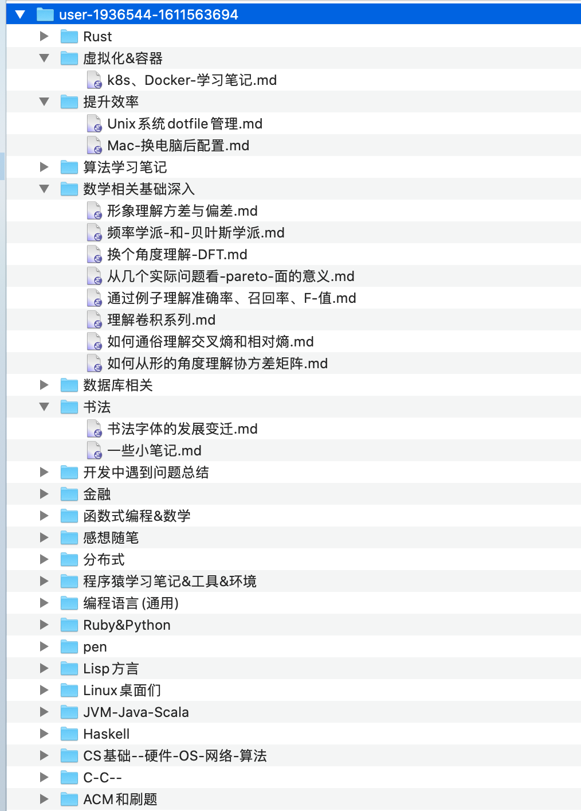
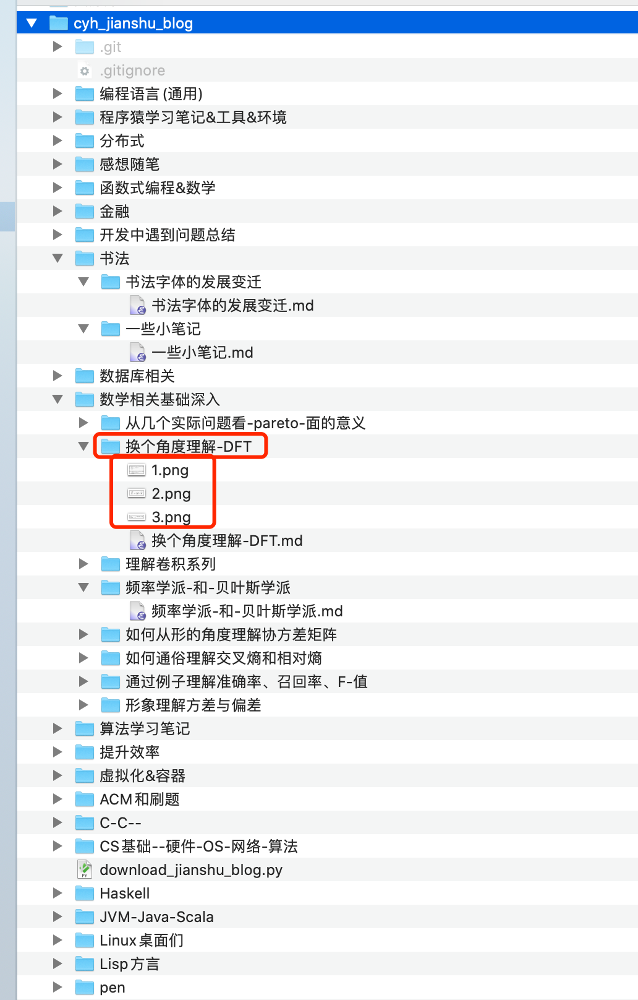

# cyh_jianshu_blog
我的简书blog

# 背景

个人在简书上面写了很多 blog，简书听良心，可以把 blog 导出到本地。但是原 blog 可能是带图片的，导出后直接是一个图片 URL 了。
所以我想的是写个脚本处理一下，把图片下载到本地，然后把 URL 替换成本地的图片路径。

这么做的好处是做一个备份，万一哪天比如简书不支持导出了、比如这平台被封了不让用了等等之类的，那么写的文章就全没了。

# 使用方法及注意事项
环境：我本地是Python3.9

src_path：简书平台导出到本地的存放路径，一般是类似 `/Users/yj/Downloads/user-1936544-1611563694` 这种。
dst_path：我期望存放的地方，例如 `/Users/yj/cyh_jianshu_blog`。

这两个地方改好后，跑一下代码就 OK。

简书导出的格式长这样，

我期望的长这样，

可以看到，我期望的和简书导出的相比，多了一层和文件名同名的目录，该目录下存放着原 markdown 格式文本文件，以及图片。

# 实现解读

略，代码很简单。