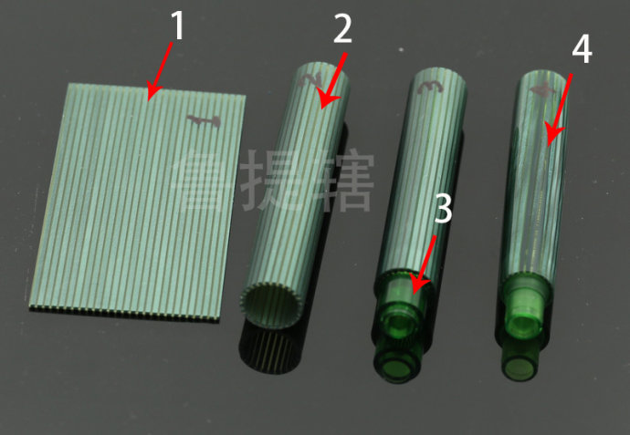

大型 21K、3776、743/823/845、大豆、M800、146，这些笔的笔尖大小基本属于同一档。如果是同时开始使用这几支笔，按手感喜好排名，21K一开始并不会排在前列；但随着使用时间增长，坚持到一年以上，21k的排位势必会逐渐上升，越品越有味道。

大 21k 尖比 743/823/845 小一点。

据论坛名人 wog 的意见，10 号尖和 15 号尖不如 5 号好控制……同价位 21K 各方面比较好。

百乐的 15 号尖比龙 146 稍微大一点点。

2017 年初的数据，写乐的市值不及百乐的 1/10。
> 其实写乐可以吐槽的地方挺多的：21k 的渣杆子、吸墨器到现在都不知道研发、土到家的官网、混乱的排版、找畅销产品翻十几页、把目录按价格排。。。。。。

龙 146 到目前（2018 年 10 月）为止一共有 6 代：70 年代中后期单色 14C、80 年代单色 14K、90 年代初期双色 14K T 舌，现产 AU585 双色尖。老龙可能有铱粒大小不一、开缝不正、笔舌不居中等等类似这种问题，近产的这种问题少很多，近产的品控都很赞。

老派克是美国的，1986 全球性收购经营权转移到英国的纽汉。派克从 1987 年开始生产豆腐。笔尖常见的一种三种标：箭标（1988-1996，英产，硬滑，控墨精准，笔尖最硬）、飘带（1996-2005，英产，相对软硬适中）、桃心（2005-至今，早期英产、后期法产，相对软，出水丰沛）。法产的相对偷工减料一些。

派克目前（2018 年 10 月）先是被吉列收购，接着又被卖给了 Newell Rubbermaid。目前已关闭了美国和英国的生产基地，转由法国工厂进行制造。
威迪文在老 Waterman（威迪文的创始人） 1901 年去世后开始走下坡路，在 1954 年无奈关闭。为 Waterman 延续香火的是他们的法国子公司，也是从那个时候开始，Waterman 被认为是一家法国公司。在 1987 年时同样被吉列收归旗下，也和 Parker 一同被销售给了 Newell Rubbermaid。 
但是不可否认的是，派克虽然几易其主，但是市场占用率和知名度霸主的地位从来没有人能撼动，在中低高三个层级市场表现都有不错的建树，高端日用笔市场（非限量、定制等等，那些销量实在太有限了，主要作用是吸引眼球的）主要和派克竞争的就是万宝龙了，鸟目前都还未能进入前2。可能鸟笔的盈利能力也没有超过 lamy，但是现在在中国一级城市市场还有知名度，但是在国内二三线城市谈到壮大，还任重道远。鸟笔前景还是有的，毕竟也有活塞上墨和德国血统的噱头。

派克世纪有一个容易下水中断的毛病，原因是上墨器太细，墨水表面张力不容易被破坏，所以要解决此问题最好用流动性比较好的墨水。

百乐 742、743 的杆帽是通用的，它们的直径相同，两款区别仅仅是长度。但 742 和 743 笔舌不同，无法通用。
百乐的笔，配重都做得非常好，比较平衡，无论是比较轻的笔，还是比较重的笔，用起来都没有什么不适感。

百乐的 URUSHI 30 号尖生漆的笔，笔握也跟 845 一样，是树脂。。。。。。

百乐 845 笔杆和笔帽用的硬橡胶覆生漆，笔帽定、笔杆尾、笔帽下缘、笔帽金环之间的黑色环、笔握，都是树脂（小日本真心会偷工减料啊）。
写乐笔王硬橡胶除了笔握是树脂外，其他都是硬橡胶。
白金出云赤溜全身都是硬橡胶，包括笔握。

威迪文查尔斯顿很适合日用速记，硬滑流畅。但是笔尖小家子气，笔尖短握笔不得不稍微往上一点，另外笔身树脂材料很一般，做工略粗糙。

猫版名言，龙是看得见的地方做得比鸟好，鸟是看不见的地方做得比龙好。
说到看不见的地方，特别是活塞，龙就远远比不上鸟了。拆过万宝龙跟百利金的活塞的笔友都知道，鸟的活塞设计最为合理（双活塞片，活塞杆跟活塞片是活动连接），很少见百利金活塞坏的。而万宝龙的活塞，墨水漏到后面去就是经常的事情。另外百利金的笔身有双层，里面一层好像是专门为活塞结构设计（注：绿条蓝条等是双层的，黑金大理石等应该是只有一层），而万宝龙就是一层。据说百利金的三代活塞，还是有专利的。
以上摘抄自鲁提辖博客。
1，醋酸纤维经过上色，压缩，切割，形成醋酸纤维层板
2，卷曲，拼接
3，放置树脂内胆，用以储墨
4，打磨抛光

德国以前有本钢笔杂志叫Skiptum的（双月刊）在1997年的某期上曾仔细解剖了这两支笔，有很多物理数据，也做了些对比试验，如20分钟不关笔帽后出水情况，飞机上是否漏水等等。然后又发起一个所有订阅者选出1997年Skiptum年度钢笔的评选，在此次评选中M800击败了146。

2005 年左右的PENHERO网站上的评选历史上最好的笔，M800仅次于PARKER 51，排在第二位。

**记录坛子关于活塞的一些讨论：**
“活塞笔活塞侧漏是很正常的，但是正常使用其实很难发生侧漏。而鸟笔又是活塞里最最靠谱稳定的。当然，毕竟是活塞笔么。。。所以活塞笔早就被彻底淘汰了” 
“parker waterman lamy这种，子弹上水、转换器上水两用的模式啊。这才是目前最先进靠谱的上水模式。”
“鸟的活塞是所有活塞笔里面最靠谱的，并且距离第二名其实是超过一个数量级的。龙的活塞就算排在第二位，那也是完全不是一条街上的第二位。”
--- 猫版原话，说到鸟笔活塞侧漏问题时。

“以技术眼光来看，肯定是卡式墨芯+转换器这种先进。龙鸟等活塞主要是可玩性，毕竟买高级钢笔都是玩家为主，活塞主要是能迎合现在玩家的好玩、复古、情怀、仪式感这些心态。”
--- 坛子玩家 cylinux

坛友问：“现产的龙鸟活塞应该靠谱吧?
猫版：”过得去而已。你要说靠普哇，那结论是：古董技术手段根本不靠谱。”
