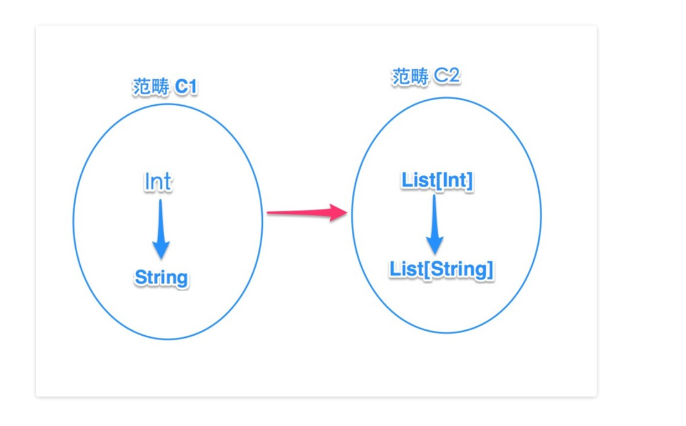
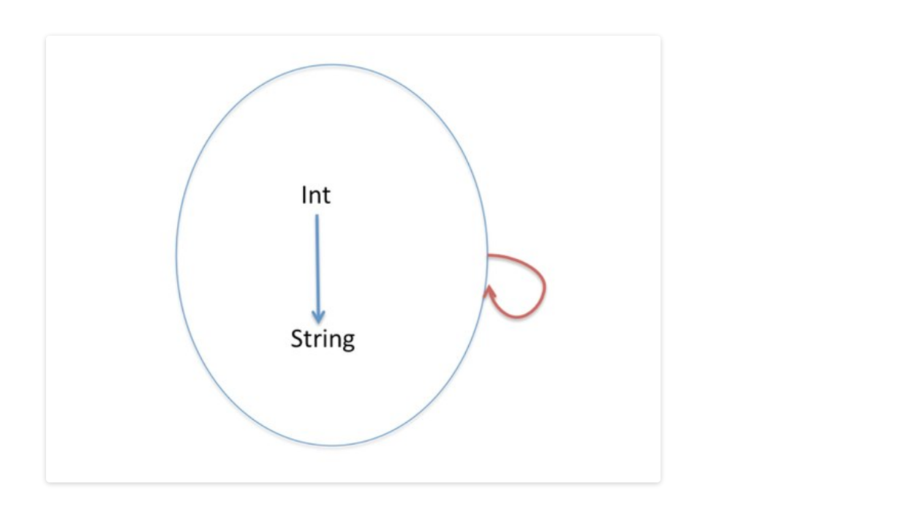
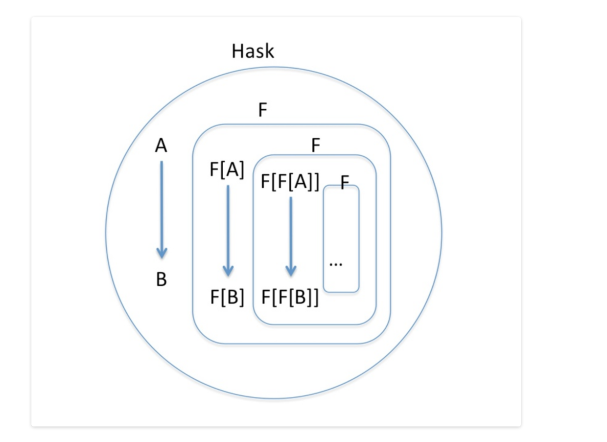

梳理这些概念：group、semigroup、monoid、functor、endofunctor、combinator、monad，并深入理解范畴论在函数式中的应用。
这里都是梳理自宏江老师的博客，这里是看完别人写的，想自己记录一遍，以检验是否真的理解。

# group 、 semigroup 与 monoid

group 是个数学中的概念，翻译为“群”，数学中用大写字母 G 表示一个群。其定义如下：
```
如果在G上定义的二元运算 *，满足
（1）Closure（封闭性）：对于任意 a，b ∈ G，有 a * b ∈ G
（2）Associativity（结合律）：对于任意 a，b，c ∈ G，有（a * b）* c = a *（b * c）
（3）Identity（幺元）：存在幺元 e，使得对于任意 a ∈ G，e * a = a * e = a
（4）逆元：对于任意 a ∈ G，存在逆元 a^-1，使得 a^-1 * a = a * a^-1 = e
则称（G，*）是群，简称 G 是群。
```
如果仅满足封闭性和结合律，则称 G 是一个 Semigroup（半群）；
如果仅满足封闭性、结合律并且有幺元，则称 G 是一个Monoid（含幺半群）。

用代码具体展示，如下，
```scala
trait SemiGroup[T] {
    def append(a: T, b: T): T
}
```
特质 SemiGroup，定义了一个二元操作的方法 append，可以对半群内的任意 2 个元素结合，且返回值仍属于该半群。

一个 Int 类型的半群实例：
```scala
object IntSemiGroup extends SemiGroup[Int] {
    def append(a: Int, b: Int) = a + b
}

// 对2个元素结合
val r = IntSemiGroup.append(1, 2)
```

现在在半群的基础上，再增加一个幺元(Identity，也翻译为单位元)，
```scala
trait Monoid[T] extends SemiGroup[T] {
    // 定义单位元
    def zero: T
}
```

构造一个 Int 类型的 Monoid 实例：
```scala
object IntMonoid extends Monoid[Int] {
    def append(a: Int, b: Int) = a + b    // 二元操作
    def zero = 0    // 单位元
}
```

还可以构造一个复杂点的 List[T] 的 Monoid 工厂方法：
```scala
def listMonoid[T] = {
    new Monoid[List[T]] { 
        def zero = Nil
        def append(a: List[T], b: List[T]) = a ++ b 
    }
}
```

# monoid/semigroup 的用途 --- 以 fold、并行运算 为例
上面搞了那么多概念介绍 Monoid 和 Semigroup，那么它们有什么用呢？
先从函数式数据结构中常见的 fold 操作说起。
以左折叠为例，
```scala
def foldLeft[B](z: B)(op: (B, A) => B): B
```
左折叠是用一个初始元素 z 从 List 的左边第一个元素开始操作，一直到对所有的元素都操作完。
例如 `List("A","B","C").foldLeft("")(_+_)` ，foldLeft 传入的两个参数 --- 空字符串、二元操作函数 _+_，不正好符合 StringMonoid 的定义吗？
```scala
object StringMonoid extends Monoid[String] {
    def append(a: String, b: String) = a + b
    def zero = ""
}
```
所以上面的 foldLeft 操作可以改写为 `List("A","B","C").foldLeft(StringMonoid.zero)(StringMonoid.append)` 

现在可以把 Monoid 看成基于二元操作(且提供单位元)的计算能力的抽象。
其实，Monoid/SemiGroup 中的结合律(associativity)特性才是它的威力所在，这个特性使得并行运算变得容易。因为 SemiGroup 里的“结合律”特性，使得可以对一些任务拆分采用并行处理，只要这些任务的结果类型符合“结合律”(即没有先后依赖)。

如果数据是巨大的，无疑要采用 map-reduce 的思路，化大为小各个击破，例如用 Actor 处理，最后再汇总结果。

```scala
type Result = Map[String,Int]
object combiner extends SemiGroup[Result] {

    def append(x: Result, y: Result): Result = {
        val x0 = x.withDefaultValue(0)
        val y0 = y.withDefaultValue(0)
        val keys = x.keys.toSet.union(y.keys.toSet)
        keys.map{ k => (k -> (x0(k) + y0(k))) }.toMap
    } //不考虑效率
}
```

现在假设不同的 actor 分别返回 r1、r2，
```scala
val r1 = Map("hello" -> 1, "world" -> 2)
val r2 = Map("hello" -> 2, "ok" -> 5)

val counts = combiner.append(r1, r2)
```
如果有其他 actor 再返回结果的话，只要继续合并下去，
```scala
combiner.append(r3, counts)
```
Monad 并不是为了并发而发明的，只是它正好是一个 Monoid/SemiGroup，SemiGroup 的结合律符合并行运算(由 SemiGroup 演化出来的“Trace monoid（迹幺半群）”和“History monoid（历史幺半群）”是进程演算和并行计算的基础)。这是另一个方向，不继续涉及下去，我们后续回到 Monad 的其他特征上。

# functor 

乍一看名字，以为函子(functor)对函数(function)是一种封装，实际没有关系，尽管他们都是表示映射，但两者针对的目标不一样。

function 表达的映射关系在类型上体现在特定类型(proper type)之间的映射，例如 
```scala
// Int => String
scala> def foo(i:Int): String = i.toString

// List[Int] => List[String]
scala> def bar(l:List[Int]): List[String] = l.map(_.toString)
```
而 functor，则是体现在范畴(可把范畴简单的看成高阶类型)之间的映射。
> 范畴是对象的集合，。

functor 这个术语是来自群论(范畴论)里的概念，表示的是范畴之间的映射，那范畴又与类型之间是什么关系？
简单来说就是，范畴可以看做一组类型的集合，类型之间有箭头，箭头代表态射（可以理解为函数，表示范畴 **之内** 的映射）。而 functor 表示范畴 **之间** 的映射。

举例来说，假设这里有两个范畴：范畴 C1 里面有类型 String 和类型 Int；范畴C2 里面有 List[String] 和 List[Int]，


从上图例子来看，这两个范畴之间有映射关系，即在 C1 里的 Int 对应在 C2 里 的 List[Int]，C1 里的 String 对应 C2 里的 List[String]。在 C1 里存在 Int->String 的关系态射(术语是 morphism，我们可理解为函数)，在 C2 里也存在 List[Int]->List[String] 的关系态射。

换句话说，如果一个范畴内部的所有元素可以映射为另一个范畴的元素，**且** 元素间的关系也可以映射为另一个范畴元素间关系，则认为这两个范畴之间存在映射。所谓 functor 就是表示两个范畴的映射。

接着上面的分析。
一个存放字符串的List (List[String]) 与存放整数的List (List[Int]) 是不同的，但是从一个转换成另一个是有用的。functor 就是来干这个事情的（结合上面的图理解）。


下面用代码来描述 functor。

从上图的例子可以总结出 functor 的含义，即它包含两个层面的映射：
```
1) 将 C1 中的类型 T 映射为 C2 中的 List[T] :  T => List[T]
2) 将 C1 中的函数 f 映射为 C2 中的函数 fm :  (A => B) => (List[A] => List[B])
```

要满足这两点，我们需要一个类型构造器（不妨将两个层面的映射分为称为 type 映射、func 映射），
```scala
trait Functor[F[List]] {
    def typeMap[T]: List[T]                   // type 映射
    def funcMap[A,B](f: A=>B): List[A]=>List[B]     // func 映射
}
```
现在把这个定义再抽象并简化一些，type 映射可以不用，并把它作为一个 type class：
```scala
trait Functor[F[_]] {
    def map[A,B](fa: F[A], f: A=>B): F[B]
}
```

我们自定义一个 My[A] 的类型构造器并直接在类型构造器的定义中实现 map 方法，
```scala
case class My[A](e:A) {
    def map[B](f: A=>B): My[B] = My(f(e))
}
```
这样相当于显式的让 My 同时具备了对类型和函数的映射（A->My[A]，A=>B -> My[A]=>My[B]）。

在 haskell 里把这两个行为也叫提升(lift)，相当于把类型和函数放到容器里。所以也可以说一个带有 map 方法的类型构造器，就是一个 functor。

最后再 **总结地来看范畴与高阶类型**。
如果忽略范畴中的关系(函数)，范畴其实就是对特定类型的抽象，即高阶类型(first-order-type 或 higher-kinded-type，也就是类型构造器)。对于上面例子中的”范畴 C2″，它的所有类型都是 List[T] 的特定类型，这个范畴就可以抽象为 List 高阶类型。那对于”范畴 C1″呢？它又怎么抽象？其实，”范畴 C1″的抽象类型可以看做是一个 Identity 类型构造器，它与任何参数类型作用构造出的类型就是参数类型 --- `type Id[T] = T`。

这么看的话，如果范畴也可以用类型(高阶)来表达，那岂不是只用普通函数就可以描述它们之间的映射了？别急，先试试，在 Scala 语言规范里，方法是不支持类型构造器做参数的：
```scala
scala> def foo(param: Id) = print(param)
    <console>:18: error: type Id takes type parameters
```
方法中只能使用特定类型(proper type)做参数，例如 `def foo(param: Id[List])` 这种就可以，而 `def foo(param: Id)` 不可以。

# endofunctor

理解 endofunctor（自函子） 之前，首先了解一下 endofunction（自函数）。把参数和返回值是相同类型的函数称作 endofunction（自函数），比如 Int=>Int, String=>String 等。
> 注意 **区分自函数与 Identity 函数的差异**：Identity 函数什么也不做，传入什么参数返回什么参数，它属于自函数的一种 **特例**；自函数是入参和出参的类型一致，比如 (x:Int) => x * 2 或 (x:Int) => x * 3 都属于自函数。

上面了解了自函数，那么自函子是什么呢？
自函子就是一个将范畴映射到自身的函子 (A functor that maps a category to itself)。

先考虑一种特殊情况，如下图，

假设这个自函子为 F，则对于 F[Int] 作用的结果仍是 Int，对于函数 f: Int=>String 映射的结果 F[f] 也仍是函数 f，所以这个自函子实际是一个 Identity 函子(自函子的一种特例)，即对范畴中的元素和关系不做任何改变。

那怎么描述出一个非 Identity 的自函子呢？
介绍范畴在程序上用法的资料里通常都用 haskell 来举例。haskell 把所有类型和函数都放到一个范畴里，取名叫 Hask，那么对于这个 Hask 范畴，它看上去像是这样，


A, B 代表普通类型如 String, Int, Boolean 等，这些(有限的)普通类型是一组类型集合，还有一组类型集合是衍生类型(即由类型构造器与类型参数组成的)，这是一个无限集合(可以无限衍生下去)。这样范畴 Hask 就涵盖了 haskell 中所有的类型。

对于范畴 Hask 来说，如果有一个函子 F，对里面的元素映射后，其结果仍属于 Hask，例如用 List 这个函子，
```scala
List[A], List[List[A]], List[List[List[A]]]...
```
这些映射的结果也是属于 Hask 范畴(子集)，所以这是一个自函子，实际上在 Hask 范畴上的所有函子都是自函子。

稍微总结一下 funtor 和 endofunctor，
一个 funtor 可以将一个范畴映射到 **另一个** 范畴：F a -> F b。
一个 endofunctor 将一个范畴映射到 **同一个** 范畴：F a -> F a。
> 这里 F 代表一种函子类型，a 代表一个范畴变量（意思是它可以表示任何范畴，包括一个集合或者一个同一类数据类型的所有可能值的范畴）。

最后，仔细观察这个 Hask 范畴的结构，发现它实际是一个 fractal 结构（分形结构），这是个很神奇的结构，在自然界也大量存在，


如上面的这片叶子，它的每一簇分支，形状上与整体的形状是完全一样的，即局部与整体是一致的结构(并且局部可以再分解下去)。

这种结构在函数式语言里也是很常用的，最典型的如 List 结构，由 head 和 tail 两部分组合而成；每个 tail 又是一个 List 结构，可以递归的分解下去。

到这里，不得不佩服数学的美和强大！

# combinator

组合子，英文叫 combinator，是函数式编程里面的重要思想。如果说 OO 是归纳法（分析归纳需求，然后根据需求分解问题，解决问题），那么 “面向组合子”就是“演绎法”。通过定义最基本的原子操作，定义基本的组合规则，然后把这些原子以各种方法组合起来。

引用另外一位函数式领域的大师的说法，
```
A combinator is a function which builds program fragments from program fragments.
```

更具体一些，把scala的集合库里提供的一些函数看成 combinator，
```scala
map、foreach、filter、fold/reduce、zip/partition、flatten/flatMap
```
而 monad 正是一个通用的 combinator，也是一种设计模式。
> 不光 OO 中有许多设计模式，面向组合子编程（以下简称 CO）时也有设计模式。那帮函数式编程的大牛们，总结出了许多经典的组合方式，这些组合方式可以理解为面向组合子编程的设计模式。
> 其实设计模式，说成大白话就是：用固定的套路解决问题。

# monad

先从最简单的情况开始，用 monad 封装一段执行逻辑，然后提供一个 map 组合子，可以组合后续行为，
```scala
// 一个不完善的 monad
class M[A](inner: => A) {
    // 执行逻辑
    def apply() = inner
    // 组合当前行为与后续行为，返回一个新的monad
    def map[B](next: A=>B): M[B] = new M(next(inner))
}
```

用上面这个不完善的 monad 来模拟几个行为的组合，
```scala
scala> val first = new M({println("first"); "111"})
first: M[String] = M@745b171c

scala> val second = first.map(x => {println("second"); x.toInt})
second: M[Int] = M@155f28dc

scala> val third = second.map(x => {println("third"); x + 200})
third: M[Int] = M@b345419

scala> third()
first
second
third
res0: Int = 311
```

其实在 Function1 这个类里已经提供了对只有一个参数的函数的组合，
```scala
scala> class A; class B; class C

scala> val f1: A=>B = (a:A) => new B

scala> val f2: B=>C = (b:B) => new C

scala> val f3 = f1 andThen f2
f3: A => C = <function1>
```
Function1 里的 andThen 方法可以把前面函数的结果交给后边的函数处理，A=>B 与 B=>C 组成函数 A=>C

这样看上去前面那个不完善的 monad 和 Function1 有些相似，它们都封装了一段行为，提供方法将下一个行为组合成新的行为(可以不断的组合下去)。

### 讨论两个问题：行为链的校验问题和副作用的问题

#### 行为链的校验问题

上面那个 monad 终归是一个不完善的 monad，它有一个严重的问题就是无法处理这样一种情况。比如 f: A=>B 这个函数表示一个行为，这个行为最终得到的数据类型是 B，但如果这个行为遇到异常，或者返回为 null。这意味着我们必须在组合过程中判断每个函数的结果是否合法，并且只有合法的情况下，才能与下一步组合。

当然，把这些判断放在组合逻辑里确实可以 work，例如，
```scala
def map[B](next: A=>B): M[B] = { 
        val result = inner  // 执行了当前行为
        if(result != null) {
            new M(next(result))
        }else {
            null.asInstanceOf[M[B]]
        }
    }
```
这种方式最大的弊端是，要判断当前行为(inner)的结果是否符合传递给下一个行为，**只有执行当前行为才能拿到结果**。而我们希望组合子做的是先把所有行为组合起来，最后再一并执行。

看来只能要求 next 函数在实现的时候做了异常检测，但即使 next 函数做了判断，也不一定完美。因为行为已经先被组合好了，执行的时候，链上的每个函数仍会被调用。假设组合了多个函数，执行时中间的一个函数即使为 null，仍会传递给下一个执行（下一个也必须也对参数检测），但其实这个时候已经没有必要传递下去了。

在 scala 里对这种结果不确定的情况，提供了一个专门的 Option，它有两个子类：Some 和 None，其中 Some 表示结果是一个正常值，可以通过模式匹配来获取到这个值，而 None 则表示为空的情况。

所以可以用 Option 来表示前面的行为，即写为 f: A=>Option[B]。它表明结果被一个富类型给包装起来，它表示结果可能有值，也可能为空。

#### 副作用的问题

除了上面提到的问题，另外一个无法用函数式完美解决的问题是 IO 操作，这是因为 IO 无论如何总要伴随状态的产生或变化(也就是副作用)。

一段常见的举例片段，
```scala
def read(state: State) = {
    // 返回下一状态和读取到的字符串
    (state.nextState, readLine)
}

def write(state: State, str: String) = {
    //返回下一状态，和字符串处理的结果
    //这里是print返回为Unit类型，所以最终返回一个State和Unit的二元组
    (state.nextState, println(str))
}
```
这两个函数类型为 State => (State, String) 和 (State,String) => (State, Unit)，在入参和出参里都伴随State，是一种“不纯粹”的函数。因为每次都执行状态都不一样，即使两次的字符串是一样的，状态也是不同的。
这是一种典型的“非引用透明”问题，这样的函数无法满足结合率，函数的组合性无法保障。

要实现组合特性，需要把函数转换为符合“引用透明”的特性，可以通过柯里化来把两个函数转化为高阶函数，
```scala
def read = 
    (state: State) => (state.nextState, readLine)

def write(str: String) = 
    (state: State) => (state.nextState, println(str))
```
现在这两个函数相当于 **只是构造了行为**，要执行它们需要后续传入“状态”才行；等于把执行推迟了。现在这两个函数现在符合“引用透明”的特性了。

再进一步，把 State 的构造行为给隐藏起来，
```scala
class IOAction[A](expression: =>A) extends Function1[State, (State,A)] { 
    def apply(s:State) = (state.next, expression) 
}

def read = new IOAction[String](readLine)
def write(str: String) = new IOAction[Unit](println(str))
```
现在可以把 read 看做是一个 () => IOAction[String] 的函数，write 则是一个 String => IOAction[Unit] 的函数。

### 继续抽象

现实世界的行为，除了可以用 A=>B 这样的 plain function 描述，还有 A=>Option[B] 或 A=>IOAction[B]。这种结果可以用一个 **富类型** 的函数来描述，
```scala
A => Result[B]
```
当要组合一个这种形式的行为时，不能再使用 map，而是要使用 flatMap。

实际上，在 monad 中 map 并不是必须的方法，flatMap 才是，可以把 map 看做一种特例。把行为都用统一形式 A => Result[B] 来描述，对于普通的 A=>B 也可以转为 A=>Result[B]。

最后看一个 flatMap 的例子，一个 Option 的实际例子，
```scala
scala> Some({println("111"); new A}).
        flatMap(a => {println("222");Some(new B)}).
        flatMap(b => {println("333"); None}).
        flatMap(c => {println("444"); Some(new D)})
111
222
333
res14: Option[D] = None
```

可以看到，在组合第三步的时候，得到 None，后边的第四步 `c => {println("444"); Some(new D)}` 没有被执行。这是因为 None 与后续的行为结合时，会忽略后续的行为。


### 深入
从前面的实例分析得知，在 monad 中光有 map 是不够的，flatMap 才是，其实可以将 flatMap 理解为 `flatMap = map + flatten`，写成代码如下，
```scala
class M[A] {  
    private def flatten[B](x:M[M[B]]) : M[B] = ......
    def map[B](f: A => B) : M[B] = .........
  
    def flatMap[B](f: A => M[B]) : M[B] = flatten(map(f))  
}  
```
> 如果深究的话会发现，很多关于 monad 的论文使用 ”bind” 一词替代 ”flatMap”，而 Haskell 里使用 ”>>=” 操作符。它们都是一个概念。

其实 Monads 可以用不同的方式构造。
刚刚是使用 map 来构造一个 flatMap 方法。其实还有另一种可能的方式：先实现一个 flatMap 然后可以基于 flatMap 实现一个 map。为了做到这一点需要引入更多概念。在大多 monad 的论文里称为 ”unit” 的概念，在 Haskell 里它称为 ”return”。

还是以 Scala 实现为例。基本上，unit 接受一个 A 类型的值，返回一个 M[A] 类型的 monad。对于 List，unit(x) == List(x) ；对于Option，unit(x) == Some(x)(这里的 List(x) 和 Some(x) 都是 scala 的伴生对象的工厂方法)。

其实，也可以不需要一个独立的 unit 函数，写不写 unit 是一个编码的风格问题。除了上面的写法，还显式的写 unit 方法，它只是在内部使用，
```scala
class M[A](value: A) {  
    private def unit[B] (value : B) = new M(value)  
    def map[B](f: A => B) : M[B] = flatMap {x => unit(f(x))}  
    def flatMap[B](f: A => M[B]) : M[B] = ......  
}  
```
> 在这个版本的 flatMap 的实现不引用 map 或 flatten，它将一气呵成地完成这两个操作。

通过上面的举例、推演可以看到，flatMap 是 monad 的”心脏“。虽然可以通过 map + flatten 来实现 flatMap，但是当关心的 monad 不是集合时，flatMap 应该先实现，然后 map 基于 flatMap 和 unit 来实现。
> 最佳实践。

最后，将 Haskell、Scala 和一些论文中描述 monad 的一些名词做一个对比。

| Generic | Haskell | Scala |
| :-: | :-: | :-: |
| `M` | `data M a` or `newtype M a` or `instance Monad (M a)` | `class M[A]` or `case class M[A]` or `trait M[A]` |
| `M a` | `M a` | `M[A]` |
| `unit v` | `return v` | `new M(v)` or `M(v)` |
| `map f m` | `fmap f m` | `m map f` |
| `bind f m` | `m >>= f` or `f =<< m` | `m flatMap f` |
|  | `do` | `for` |

> Haskell 里面的 **类型** 就对应了范畴里面的 Collection，Haskell 里面的 **Class** 就对应了范畴里面的 morphism，把 **类型** 和 **Class** 结合到一起那么就构成了一个 Instance，也就构成了一个范畴。


### 提高
有三种方式来定义 Monad，分别是范畴论、Kleisli范畴、haskell Monad 这三种。    
用范畴论的概念(return, join, fmap)定义的 Monad 如下，
```haskell
class Applicative f => Monad f where
    return :: a -> f a
    join   :: forall a. f (f a) -> f a
```

用 Kleisli 范畴(return, >=>)定义的Monad如下，
```haskell
class Monad m where
    (>=>)   :: forall a b c. (a -> m b) -> (b -> m c) -> (a -> m c)
    return  :: a -> m a
```

用 haskell monad(return, >>=)定义的Monad如下，
```haskell
class Monad m where
    (>>=)   :: forall a b. m a -> (a -> m b) -> m b
    return  :: a -> m a
```

这三种定义是等价的，(>=>) 、join、>>= 的相互定义如下，
```haskell
join m = m >>= id
join = id >=> id

m >>= f = join (fmap f m)
(>>=) = flip (id >=>)

f >=> g = \x -> f x >>= g
f >=> g = join . fmap g . f
```
