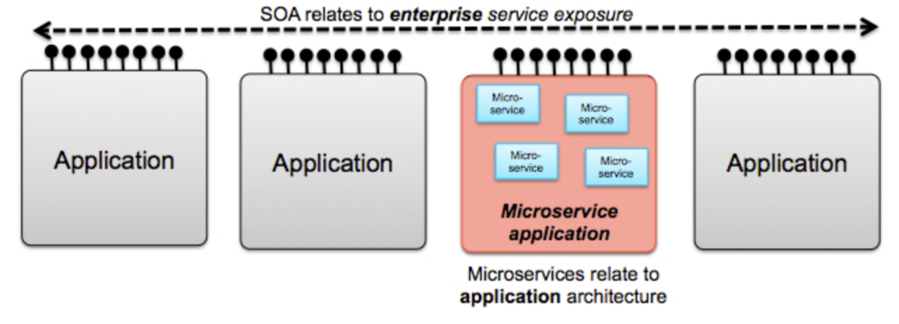
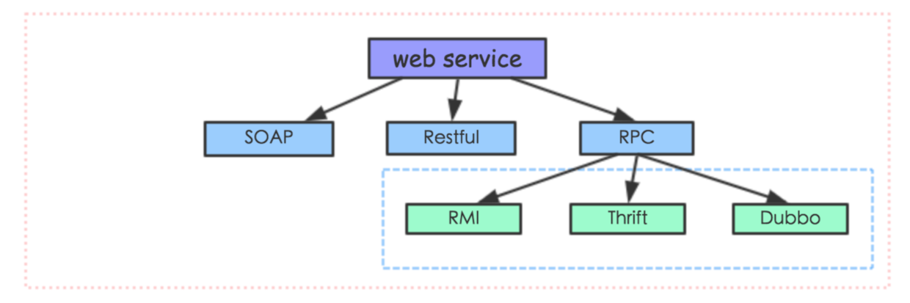
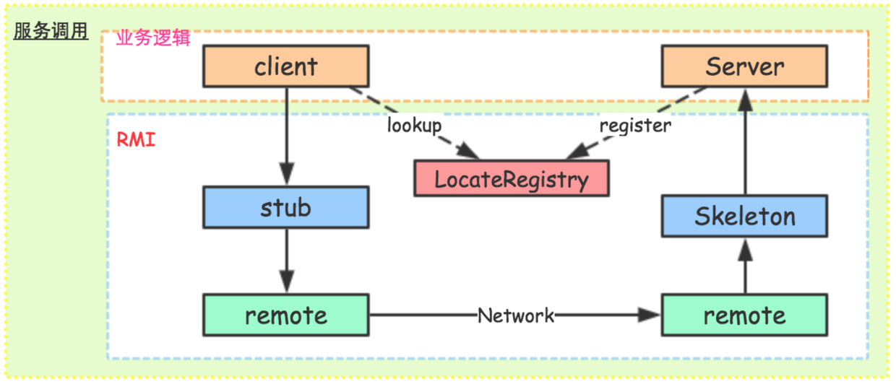
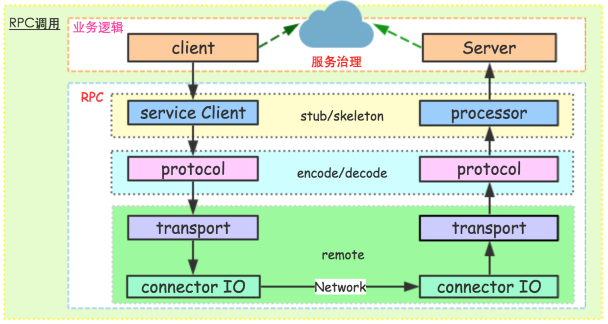
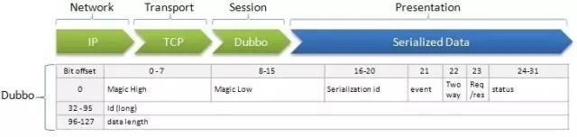

# 简介

RPC（Remote Procedure Call，远程过程调用），就是客户端基于某种 **传输协议** 通过网络向服务提供端请求服务处理，然后获取返回数据（对于ONE WAY模式则不返还响应结果）；而这种调用对于客户端而言，和调用本地服务一样方便，开发人员不需要了解具体底层网络传输协议。

# 复习 LPC 与 IPC
既然 RPC 叫做远程过程调用，那么和远程对应的，必然有本地过程调用。本地过程调用在不同的 OS 中叫法不同，在 Windows 编程中，称为 LPC；在 linux 编程中，更习惯称之为 IPC，即进程间通信。

> 不管如何，其本质上就是本地机器上的 **不同进程** 之间通信协作的调用方式。

以 Linux 为例，复习下 IPC 的几种实现方式，
- 管道。例如 `ps -ef | grep java` 
- 共享内存。Linux 提供了主要 4 个系统调用来实现，`shmget`、`shmat`、`shmdt`、`shmctl`
- 信号量。信号量其实就是一个特殊的变量，Linux 中的信号量和 Java 中的信号量一样，其主要用处是同步协作。对信号量的操作都是原子进行的，并且一般只提供两种方法：P 和 V 操作（在 java 中为 wait() 和 notify()）。
  > 注意区分协调和通信：信号量的主要作用就是同步 **协调**，所以一般使用共享内存方式完成进程间 **通信**，而在此过程中通过信号量来完成多进程间的同步协调机制。
- Socket 套接字。Socket 一般情况下是用在不同的两台机器的不同进程之间通信的，当 Socket 创建时的类型为 AF_LOCAL 或 AF_UNIX 时，则是本地进程通信了。
- 消息队列。消息队列是内核地址空间中的内部链表，通过 linux 内核在各个进程之间传递内容。
- 信号。信号提供一个机制，在需要的时候告诉某个进程该怎样做。可以用 `kill -l` 命令查看系统中定义的信号列表。
- 等等。。。。。。


# 复习 Web Service

上面说的是单机的服务调用，在互联网时代，自然就是 web 服务（Web Service）了。

Web Service 一般有两种定义，
1. 特指 W3C 组织制定的 **web service 规范** 技术。它包括三部分，
    -  SOAP。一个基于 XML 的可扩展消息信封格式，需同时绑定一个网络传输协议。这个协议通常是 HTTP 或 HTTPS，但也可能是 SMTP 或 XMPP。
    -  WSDL。一个 XML 格式文档，用以描述服务端口访问方式和使用协议的细节。通常用来辅助生成服务器和客户端代码及配置信息。
    - UDDI。一个用来发布和搜索 WEB 服务的协议，应用程序可借由此协议在设计或运行时找到目标 WEB 服务。
    > 从上面三个定义就可以看出，这种规范技术是一个 **重量级** 的协议。

2. 泛指网络系统对外提供 web service 所使用的技术。这里，主要是基于该定义来理解。

技术体系，必然是服务于架构体系的。不同的架构，所约定的技术结构设计还是有些区别的。因此，要了解 web service 技术，必然要先了解其服务于哪个架构体系；也就是说，先去了解技术产生的架构背景。

从大的面上看，分布式网络服务架构体系中，最火的莫过于 SOA（Service-Oriented Architecture，面向服务架构）和微服务。
> 其实，SOA 和微服务，就是业务外部和内部服务的不同架构设计而已，其技术框架很大程度上都可以通用。

二者区别如下图，

SOA 一般使用 SOAP 或者 REST 方式来提供服务，这样外部业务系统可以使用通用网络协议来处理请求和响应。而微服务，还可以有一些私有的协议方式来提供服务，例如基于自定义协议的 RPC 框架。


`web service`被 W3C 设立规范之初，SOAP 方案就被提出来。但是，随着服务化技术和架构的发展，SOAP 多少有点过于复杂，因此就出现了简化版的 REST 方案。
此后，由于分布式服务应用越来越大，对性能和易用性上面要求越来越大，因此就出现了 RPC 框架
> 很多时候，RPC 并不被当做一种 web service 方案。在绝大部分博客中，介绍 web service 只会讨论 SOAP 和 REST，主要是其基本上都是基于 SOA 来介绍服务方案。

### SOAP

SOAP 全称为 Simple Object Access Protocol，也就是 简单对象访问协议。历史悠久，现在也慢慢要淘汰了。

SOAP，是基于 XML 数据格式来交换数据的；其内部定义了一套复杂完善的 XML 标签，标签中包含了调用的远程过程、参数、返回值和出错信息等等，通信双方根据这套标签来解析数据或者请求服务。与 SOAP 相关的配套协议是WSDL (Web Service Description Language)，用来描述哪个服务器提供什么服务，怎样找到它，以及该服务使用怎样的接口规范，类似我们现在聊服务治理中的服务发现功能。

因此，SOAP 服务整体流程是：首先，获得该服务的 WSDL 描述，根据 WSDL 构造一条格式化的 SOAP 请求发送给服务器，然后接收一条同样 SOAP 格式的应答，最后根据先前的 WSDL 解码数据。绝大多数情况下，请求和应答使用 HTTP 协议传输，那么发送请求就使用 HTTP 的 POST 方法。


### REST

REST 全称 Representational State Transfort，也就是 表示性状态转移。由于 SOAP 方案过于庞大复杂，在很多简单的 web service 应用场景中，轻量级的 REST 就出现替代 SOAP 方案了。

和 SOAP 相比，REST 只是对 URI 做了一些规范，数据才有 JSON 格式，底层传输使用 HTTP/HTTPS 来通信，因此，所有 web 服务器都可以快速支持该方案。


# RPC 家族

## RPC 核心原理

感觉去掉细枝末节，RPC 就解决 2 个最核心的问题：如何调用别人的服务 以及 如何发布自己的服务。

一、如何调用别人的服务
怎样才能像本地调用一样调用远程服务呢？对 java 来说就是使用代理！java 代理有两种方式：jdk 动态代理 和 字节码生成。尽管字节码生成方式实现的代理更为强大和高效，但代码不易维护，大部分公司实现 RPC 框架时还是选择动态代理方式。

二、如何发布自己的服务
告诉使用者服务的 IP 以及端口就可以了。

这里有个很精简的不到一百行代码的 Toy-RPC，仅作为展示原理使用，详见 https://github.com/chenyanhao/ToyRpcFramework4Study

## RMI
RMI 是 Java 自带的官方 RPC 组件，单独介绍。
RMI，全称是 Remote Method Invocation，也就是远程方法调用。在 JDK 1.2的时候，引入到Java体系的。当应用比较小，性能要求不高的情况下，使用 RMI 还是挺方便快捷的。


其中，有些概念需要说明，
一、stub(桩)：stub 实际上就是远程过程在客户端上面的一个代理 proxy。当我们的客户端代码调用 API 接口提供的方法的时候，RMI 生成的 stub 代码块会将请求数据序列化，交给远程服务端处理，然后将结果反序列化之后返回给客户端的代码。这些处理过程，对于客户端来说，基本是透明无感知的。
二、remote：这层就是底层网络处理了，RMI 对用户来说，屏蔽了这层细节。  stub 通过 remote 来和远程服务端进行通信。
三、skeleton(骨架)：和 stub 相似，skeleton 则是服务端生成的一个代理 proxy。当客户端通过 stub 发送请求到服务端，则交给 skeleton 来处理，其会根据指定的服务方法来反序列化请求，然后调用具体方法执行，最后将结果返回给客户端。
四、registry(服务发现)：rmi 服务，在服务端实现之后需要注册到 rmi server上，然后客户端从指定的 rmi 地址上 lookup 服务，调用该服务对应的方法即可完成远程方法调用。registry 是个很重要的功能，当服务端开发完服务之后，要对外暴露，如果没有服务注册，则客户端是无从调用的，即使服务端的服务就在那里。

RMI 的简单示例如下，
```java
/**
 * 接口必须继承RMI的Remote
 */
public interface RmiService extends Remote {

    /**
     * 必须有 RemoteException，才是 RMI 方法
     */
    String hello(String name) throws RemoteException;
}

/**
 * UnicastRemoteObject 会生成一个代理 proxy
 */
public class RmiServiceImpl extends UnicastRemoteObject implements RmiService {

    public RmiServiceImpl() throws RemoteException {
    }

    public String hello(String name) throws RemoteException {
        return "Hello " + name;
    }
}

/**
 * 服务端 server 启动
 */
public class RmiServer {

    public static void main(String[] args) {
        try {
            RmiService service = new RmiServiceImpl();
            //在本地创建和暴露一个注册服务实例，端口为 9999
            LocateRegistry.createRegistry(9999);
            //注册 service 服务到上面创建的注册实例上
            Naming.rebind("rmi://127.0.0.1:9999/service1", service);
        }catch (Exception e){
            e.printStackTrace();
        }
        System.out.println("------------server start-----------------");
    }
}


/**
 * 客户端调用 rmi 服务
 */
public class RmiClient {
    public static void main(String[] args) {
        try {
            // 根据注册的服务地址来查找服务，然后就可以调用API对应的方法了
            RmiService service = (RmiService)Naming.lookup("rmi://localhost:9999/service1");
            System.out.println(service.hello("RMI"));
        }catch (Exception e){
            e.printStackTrace();
        }
    }
}
```

## 通用 RPC
上面的 RMI 只适用于 Java，下面来看一个通用的 RPC 如何设计。


通用的RPC组件一般包括以下一些模块，
一、serviceClient：这个模块主要是封装服务端对外提供的 API，让客户端像使用本地 API 接口一样调用远程服务。一般，我们使用动态代理机制，当客户端调用 api 的方法时，serviceClient 会走代理逻辑，去远程服务器请求真正的执行方法，然后将响应结果作为本地的 api 方法执行结果返回给客户端应用。类似 RMI 的 stub 模块。
二、processor：在服务端存在很多方法，当客户端请求过来，服务端需要定位到具体对象的具体方法，然后执行该方法，这个功能就由 processor 模块来完成。一般这个操作需要使用反射机制来获取用来执行真实处理逻辑的方法，当然，有的 RPC 直接在 server 初始化的时候，将一定规则写进 Map 映射中，这样直接获取对象即可。类似 RMI 的 skeleton 模块。
三、protocol：协议层，这是每个 RPC 组件的核心技术所在。一般，协议层包括编码/解码，或者说序列化和反序列化工作；当然，有的时候编解码不仅仅是对象序列化的工作，还有一些通信相关的字节流的额外解析部分。序列化工具有：hessian、protobuf、avro、thrift、json系、xml系等等。在 RMI 中这块是直接使用 JDK 自身的序列化组件。
四、transport：传输层，主要是服务端和客户端网络通信相关的功能。这里和下面的 IO 层区分开，主要是因为传输层处理 server/client 的网络通信交互，而不涉及具体底层处理连接请求和响应相关的逻辑。
五、I/O：这个模块主要是为了提高性能可能采用不同的 IO 模型和线程模型，当然，一般我们可能和上面的 transport 层联系的比较紧密，统一称为 remote 模块。
六、此外，还有业务代码自己去实现的 client 和 server 层。client 当需要远程调用服务时，会首先初始化一个 API 接口代理对象，然后调用某个代理方法。server 在对外暴露服务时，需要首先实现对应 API 接口内部的方法，当请求过来时，通过反射找到对应的实例对象，执行对应的业务代码。

## 通用 RPC 组件实现
看完了上面的原理，下面就是实现了。
这里有个很精简的 Toy 代码，仅作为展示原理使用，详见 https://github.com/chenyanhao/GeneralRpcFramework4Study

> 注意和前面的极简 RPC 的对比。可以发现核心原理都是一样，就是做了模块化的拆分而已。

## RPC 深入

上面的代码都只是 demo，学习核心原理使用。如果生产环境中要使用，还是有不少复杂的技术点的。

#### RPC 序列化

考虑到 RPC 是通过网络通信的，所以序列化工具的性能以及二进制流的大小，都会影响到性能。

Java 目前常见的序列化工具有，
- JDK Serializable：原生支持，但序列化后的二进制流太大，且序列化耗时也较长。
- Hessian：序列化性能比原生好了很多，序列化之后的流也小了很多。另外，Hessian 在序列化完了之后，会保留每个 field 对应的一些属性信息，因此它不依赖 serialVersionUID 来匹配类型。Hessian 在生产环境实践了较长时间，值得使用。
- Kryo：性能非常霸道，但生成的字节码中是不包含 field 元数据信息的，这样带来了兼容性上处理的劣势。例如给对象增加一个字段，老的序列化二进制流就无法被正常反序列化。
- JSON：性能上和 Hessian 差不多，并且反序列化兼容性会好很多。但是有一个问题就是，它是基于 String 再转成二进制流的，所以流的大小并没有想象中那么好。

#### RPC 协议编解码

序列化之后，一般还需要对二进制流或对象进行一些额外的处理，而这些处理本身和二进制流没有太大关系。因此这些额外处理就是 RPC 框架的另外一个模块，即协议编解码。

每个 RPC 组件，基本上都是基于 Socket 来开发通信层功能，在网络传输中数据由于网络链路和协议的原因，会出现半包、分包和黏包的情况，这样就需要编解码协议来解码网络流。

例如，Dubbo 的协议编码格式如图，

挑几个重要的字段说明一下，
- event：表示事件，比如这个请求是 heartBeat
- req/res：表示该数据是请求还是响应
- id：请求 id，也叫 requestId，这个 id 很重要。最开始 id 是放在 data 里面的，这样只有在反序列化时才能拿到 requestId；但有时候 requestId 对应的 RPC 请求可能由于超时或已经被处理了，这时客户端对于这种 case 可以直接丢弃的，并不需要再反序列化一次。因此将 id 放在 head 里面。
- data length：表示内容的长度，解码时通过该字段来判断消息正文字节流的整个完整包。

#### RPC 路由与负载均衡

注意要区分一下 “路由” 和 “负载均衡” 这两个概念。
路由是客户端对于服务方调用链路的选择策略；而负载均衡只是完成路由的一种方式。
因此，显然，除了负载均衡之外，路由还有其他方式。

> RPC 在客户端和服务端之间，一般没有中间代理层。所以路由策略一般在客户端完成。

一般 RPC 组建中，会实现两个通用的负载均衡策略：随机和轮询。
// TODO1：随机和轮询
// TODO2：补充负载均衡的几种策略


#### RPC 超时管理

超时管理分为 客户端的超时管理 和 服务端的超时管理。

客户端的超时管理，一般设置一个超时时间，若该时间内没有收到响应，则断开连接即可。
> 客户端的超时机制非常重要。相当多的服务不可用问题，都是因为客户端没有好的超时机制，导致在服务端抖动的一段时间内，客户端一直占用连接并等待响应，耗尽服务端资源，最后导致服务端集群雪崩。

服务端的超时管理，是当服务端业务逻辑完成之后，比较执行时间和客户端设置的超时时间。如果接近，则打包服务端超时错误信息返回给客户端即可。

#### RPC 服务发现

RPC 得在客户端维持一个服务调用地址列表，同时当 RPC 服务集群有机器迁移或者增加时，需要 **实时** 更新集群机器列表。

这也就是 RPC 服务发现模块需要解决的问题。一般服务发现主要包括 2 部分，
1. 服务地址存储
2. 服务地址感知

**服务地址存储**

首先需要一个组件来存放相关 RPC 服务的数据，提供存储服务的组建很多，例如 ZK/redis/DB 等。
接着 server 端正常启动且可以提供服务之后，需要将自己的服务地址，即 IP、端口、服务信息（接口、版本号等），提交到存储服务器上。
然后 client 端启动的时候，从存储服务的机器上，根据接口、版本等服务信息拿到提供对应服务的 RPC 地址列表。
最后 client 拿着这份列表就可以开始远程调用服务了。


此外，为了更好的服务治理，需要知道哪些 client 调用了 server 对外的服务，就需要 client 在启动的时候，把自己的地址数据和调用的服务信息提交存储到存储服务上去。

**服务状态感知**

正常情况下，从存储组件那里拿到 server 端地址之后，client 自己处理路由策略，然后选择一个 server 执行远程调用。
在执行的过程中，如果有服务不可用，可以从服务列表中剔除。但是如果服务增加机器或者服务机器迁移了呢？这就需要能够及时了解 server 端集群的整体状态。
有两种方式，
1. client 启动一个定时任务，周期地去存储组件拉取最新的服务集群地址列表。但是这个周期粒度难控制。
2. client 和存储组件建立一个长连接，当存储组件发现有服务集群状态发生变更，推送给客户端。但是这又要求存储组件具有推送功能。

// TODO

#### RPC IO 多路复用

RPC 说到底是一个 C/S 服务，所以 IO 性能是其核心性能之一。
关于多线程模型和 IO 模型，需要另起一篇，详见 // TODO


