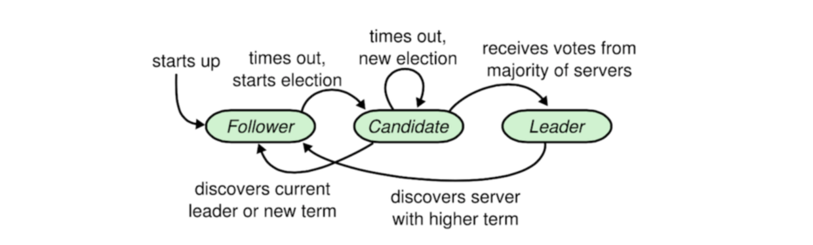
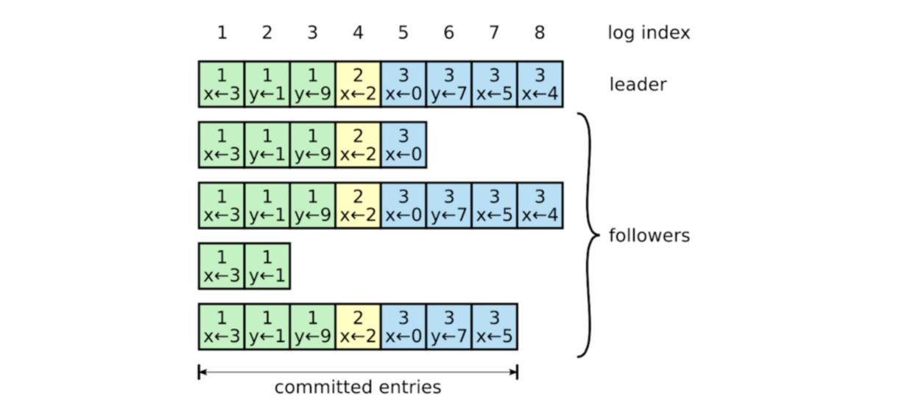
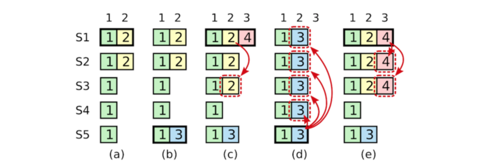
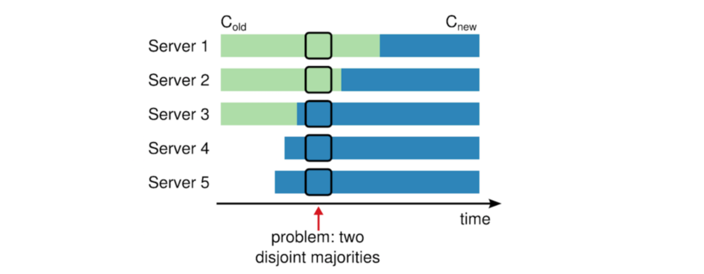

最好先通读一遍 raft 论文，raft 论文写的很通俗、工程范、却又不失严谨。认真看完后，顺着论文的思路直接可以实现出来了。

学习思路：先读一遍论文；然后熟悉协议的基本规则和哲学；最后深入研究协议对于异常情况的处理。

> 遵守基本规则，如果不出现任何异常情况，那么协议就可以 work。但是现实的系统不可能这么一帆风顺，总是有很多异常情况需要考虑。协议的复杂性也来源于对这些异常情况。因此 **异常情况应该是学习、应用中的重点** 。

学习其他分布式一致性协议也是一样的思路。

# 基本规则和哲学

## 为何 Raft 比 Paxos 容易理解

与其说 raft 是一个简化版的、更好理解的 paxos，不如说 raft 是一个限制条件更多的 paxos (因为限制条件多了，所以变化少了、复杂度低了，所以会更好理解) 。

raft 为了提高协议的可理解性，消息类型的设定及其精简，**只有** 下面两种请求，这仅有的两种请求同时也构成了 raft 的基本规则，
- requestVote 发起投票请求。Candidate 发起投票时的请求，由集群中其它 Follower 和 Candidate 接收处理。
- appendEntries 添加日志请求。Leader 向 Follower 添加日志时发出的请求。

## Leader 选举

初始时所有 server 都处于 Follower 状态，并且随机睡眠一段时间。最先醒来的 server A 进入 Candidate 状态，它有权利向其它所有 server 发出 requstVote 请求，请求其它 server 给它投票成为 Leader，同时继续保持Follower状态并重置选举计时器。
> 注意：当其它 server 收到 requestVote 请求后，将自己 **仅有的一票** 投给 server A。即每次选举投票时，只可以投一票。

当 server A 收到超过一半以上 server 的投票后，就进入 Leader 状态，成为系统中 **仅有** 的 Leader。raft 系统中只有 Leader 才有权利接收并处理 client 请求，并向其它 server 发出添加日志请求来提交日志。

## 日志复制

Leader 选举出来后，就可以开始处理客户端请求。Leader 收到客户端请求后，将请求内容作为一条 log 日志添加到自己的 log 记录中，并向其它 server 发送 appendEntries (添加日志) 请求。其它 server 收到 appendEntries 请求后，判断该 append 请求满足接收条件（接收条件在后面讨论）。如果满足条件就将其添加到本地的 log 中，并给 Leader 发送添加成功的 response。Leader 在收到大多数 server 添加成功的 response 后，就将该条 log 正式提交。提交后的 log 日志就意味着已经被 raft 系统接受，并能应用到状态机中了。
> 注意几个过程：Leader 自己的 log 记录 ---> appendEntries 请求 ---> 其他 server 本地的 log 记录 ---> 多数决 ---> Leader 提交 log。
> 注意：记录进去本地 log 时并不算提交了。

Leader具有绝对的日志复制权力，其它 server 上存在日志不全或者与 Leader 日志不一致的情况时，一切都以 Leader 上的日志为主，最终所有 server 上的日志都会复制成与 Leader 一致的状态。


# 一些会帮助理解的小细节

## 角色状态转移图和角色 rules 的关系

raft 中每个角色(Leader/Follower/Candidate)的 rules 论文都已经给出来了，按照这个 rules 去写代码就可以实现 raft。其实这些 rules 和三种角色状态关系图是有联系的。下面先放上关系图和 rule，然后解释二者之间的关系，



```
Rules for Servers

All Servers
    1. If commitIndex > lastApplied: increment lastApplied, apply log[lastApplied] to state machine
    2. If RPC request or response contains term T > currentTerm: set currentTerm = T, convert to follower 

Followers
    1. Respond to RPCs from candidates and leaders
    2. If election timeout elapses without receiving AppendEntries RPC from current leader or granting vote to candidate: convert to candidate

Candidates
    1. On conversion to candidate, start election:
        1.1 Increment currentTerm
        1.2 Vote for self
        1.3 Reset election timer
        1.4 Send RequestVote RPCs to all other servers
    2. If votes received from majority of servers: become leader
    3. If AppendEntries RPC received from new leader: convert to follower
    4. If election timeout elapses: start new election

Leaders
    1. Upon election: send initial empty AppendEntries RPCs (heartbeat) to each server; repeat during idle periods to prevent election timeouts
    2. If command received from client: append entry to local log, respond after entry applied to state machine
    3. If last log index ≥ nextIndex for a follower: send AppendEntries RPC with log entries starting at nextIndex
        3.1 If successful: update nextIndex and matchIndex for follower
        3.2 If AppendEntries fails because of log inconsistency:decrement nextIndex and retry
        3.3 If there exists an N such that N > commitIndex, a majority of matchIndex[i] ≥ N, and log[N].term == currentTerm: set commitIndex = N
```

接下来说明关系图和 rules 的关系，以 Follower 为例，
从关系图中可以看到，一共有 1 个箭头指出、2 个箭头指入(starts up 这种箭头除外)，总结一下这些指入指出的箭头可以发现：
- 指入箭头的意思是说，超时就会触发重新选主；
- 指出箭头的意思是说，Follower 分别响应 Candidate 和 Leader 的 RPC 请求。

此时对应到 rules 中去看，一目了然。
对于 Leader 和 Candidate 也是同理，不再赘述。

## 各角色之间怎么知道对方还活着

Leader 通过不断发送 appendEntries 消息给 Follower，让 Follower 知道 Leader 的存活情况（Leader 主动，Follower 被动）（appendEntries 此时有心跳的作用）。

如果 Follower 长时间未收到 Leader 的消息，它就认为 Leader 已死，于是变成 Candidate 选主（参考前面状态转移图）。


## 几个 term 和 index 辨析

一般 term 和 index 都会成对出现。
这里面涉及到几种 term/index 对，这里做一下辨析。
前面提到，raft 就两种请求：Leader 选举和日志复制。那么每一种请求就对应一对 Args 和 Reply，即 RequestVoteArgs/RequestVoteReply 、AppendEntriesArgs/AppendEntriesReply。其中 RequestVoteArgs 中有 `lastLogTerm` `lastLogIndex`，AppendEntriesArgs 中有 `prevLogTerm` `prevLogIndex` `leaderCommit`，AppendEntriesReply 中有 `current_idx` `first_idx` (这两个字段不是 raft 论文中规定的字段，它们用来优化日志追加过程，以加速日志的追加。raft 原文中的追加过程是一次只能追加一条日志)。

辨析如下，

| 字段名 | 含义 |  来自哪里
| :-: | :- | :-: |
| lastLogTerm | Candidate 本地保存的最新一条日志的任期号 | RequestVoteArgs |
| lastLogIndex | Candidate 本地保存的最新一条日志的 index | RequestVoteArgs |
| prevLogTerm | 最新日志的前一条日志的任期号 | AppendEntriesArgs |
| prevLogIndex | 最新日志的前一条日志的 index，用于 Follower 确认与 Leader 的日志完全一致 | AppendEntriesArgs |
| leaderCommit | Leader 当前已经确认提交到状态机的日志索引 index，这意味着 Follower 也可以安全地将该索引 index 以前的日志提交 | AppendEntriesArgs |
| current_idx | (优化用)处理添加日志请求后本地的最大日志索引 | AppendEntriesReply |
| first_idx | (优化用)从添加日志请求中接受的第一条日志索引 | AppendEntriesReply |

## 日志何时更新

更新时，通过 **先后** 比较两份日志中最后一条日志条目的 **任期号和索引值**，来判断谁的日志比较新。可以简单总结如下，
- 如果两份日志最后的条目的 **任期号不同**，那么 **任期号大** 的日志更加新
- 如果两份日志最后的条目 **任期号相同**，那么 **日志较长** 的日志更加新

## 关于日志同步

简单来说就是两点（这两点中第一点对应 Leader，即 **发送添加日志请求**，因为只有 Leader 才能发送添加日志的请求；第二点对应除 Leader 外的其他节点，即 **处理添加日志请求**，注意 Leader 也要处理添加日志请求，因为有可能是过时的 Leader 发过来的），
1. 发送添加日志请求：Leader 在给 Follower 发送一条日志 N 时，Leader 会顺带将自己本地前一条日志 M 的信息也带过去。Follower 会检查请求中前一条日志 M 的信息与本地相同索引的日志是否吻合，如果吻合说明本地在 M 以前的所有日志都是和Leader 一致的；
2. 处理添加日志请求：所有的服务器都有可能收到添加日志请求，比如过时的 Leader 和 Candidate 以及正常运行的 Follower。处理添加日志请求的过程主要就是验证请求中的日志是否比本地日志新的过程。

## 关于成员变更

成员变更就是添加节点和删除节点。
添加节点分为两阶段。第一阶段中新节点没有投票权，但是有接收日志的权力；当它的日志同步到最新后就进入到第二阶段，由 Leader 赋予投票权，从而成为集群中一个完整的节点。
删除节点相对比较简单，所有服务器收到删除节点的日志后，立马将该节点的信息从本地抹除。

### 添加节点

1. 管理员向Leader发送添加成员命令
2. Leader 添加一条 RAFT_LOGTYPE_ADD_NONVOTING_NODE 日志，即添加没有投票权的节点。该日志与其它普通日志一样同步给集群中其它服务器。收到该日志的服务器在本地保存该新成员的信息。
3. 当新成员的日志同步到最新后，Leader 添加一条  RAFT_LOGTYPE_ADD_NODE 日志，即有投票权的节点。同样地，该日志与其它普通日志一样同步给集群中其它服务器。收到该日志的服务器在本地保存该新成员的信息，以后的投票活动会将该新成员考虑进去。


### 删除节点
1. 管理员向 Leader 发送删除成员命令。
2. Leader 添加一条 RAFT_LOGTYPE_REMOVE_NODE 日志，并跟普通日志一样同步给其它服务器。收到该日志的服务器立即将被成员信息从本地删除。


# 异常状况的讨论

## 一、Leader选举过程中，如果有两个 server A 和 B 同时醒来并发出requestVote 请求怎么办？

由于在一次选举过程中，一个 server 最多只能投一票，这就保证了 server A 和 B 不可能同时得到大多数（一半以上）的投票。如果 A 和 B 可能刚好都得到一半的投票，两者都成为不了 Leader。这时 A 和 B 继续保持 Candidate 状态，并且随机睡眠一段时间，等待进入到下一个选举周期。

## 二、Leader挂了后，如何选举出新的Leader？

前面提到，Leader会周期性地发出 appendEntries 请求。如果 Follower 经过一个预定的时间都没有收到 Leader 的心跳，就认为 Leader 挂了，转入 Candidate 状态，开始发起投票竞选新的 Leader 。每个新的 Leader 产生后就是一个新的任期，每个任期都对应一个唯一的任期号 term。这个 term 是单调递增的，用来唯一标识一个 Leader 的任期。投票开始时，Candidate 将自己的 term 加 1，并在 requestVote 中带上 term；Follower 只会接受任期号 term 比自己大的 requestVote 请求，并为之投票。**这条规则保证了只有最新的 Candidate 才有可能成为 Leader**。

## 三、Follower 在收到一条 appendEntries 添加日志请求后，是否立即保存并将其应用到状态机中去？如果不是立即应用，那么由什么来决定该条日志生效的时间？

Follower 在收到一条 appendEntries 后，首先会检查这条 appendEntries 的来源信息是否与本地保存的 Leader 信息符合，包括 leaderId 和任期号 term。检查合法后就将日志保存到 **本地 log** 中，并给 Leader 回复添加 log 成功，**但是不会立即将其应用到本地状态机**。Leader 收到大部分 Follower添加 log 成功的回复后，就正式将这条日志 **commit 提交**。Leader 在随后发出的心跳 appendEntires 中会带上 **已经提交日志索引**。Follower 收到 Leader 发出的心跳 appendEntires 后，就可以确认刚才的 log 已经被 commit (提交) 了，**这个时候 Follower 才会把日志应用到本地状态机**。

> appendEntires 请求 ( 也用作 heartBeat ) 的内容，其中 leaderCommit 即是 Leader 已经确认提交的最大日志索引。Follower 在收到 Leader 发出的 appendEntires 后即可以通过 leaderCommit 字段决定哪些日志可以应用到状态机。

| 字段名 | 含义 | 
| :-: | :-: | 
| term | Leader 任期号 | 
| leaderId | Leader 的 Id | 
| prevLogIndex | 新的日志条目紧随之前的索引值 | 
| prevLogTerm | prevLogIndex 的任期号 | 
| entries | 准备存储的日志条目，表示心跳时可以为空，一次性发送多个是为了提高效率 | 
| leaderCommit | Leader 已经提交的日志索引值 | 


## 四、假设有一个 server A 宕机了很长一段时间，它的日志已经落后很多。如果 A 重新上线，而且此时现有 Leader 挂掉，server A 刚好竞选成为了 Leader。按照日志都是由 Leader 复制给其它 server 的原则，server A 会把其它 Follower 已经提交的日志给抹掉，而这违反了 raft 状态机安全特性，raft 怎么解决这种异常情况？

所谓的状态机安全特性即是“如果一个 Leader 已经在给定的索引值位置的日志条目应用到状态机中，那么其他任何的服务器在这个索引位置不会提交一个不同的日志”。

如果 server 在竞选 Leader 的过程中不加任何限制的话，携带旧日志的 server 也有可能竞选成为 Leader，就必然存在覆盖之前 Leader 已经提交的日志可能性，从而违反状态机安全特性。

raft 的解决办法很简单，就是 **只有具有最新日志的 server 的才有资格去竞选当上 Leader**。具体是怎么做到的呢？首先任何 server 都还是有资格去发起 request_vote 请求去拉取投票的，request_vote 中会带上 server 的日志信息，这些信息标明了 server 日志的新旧程度，如下表所示，

| 字段名 | 含义 | 
| :-: | :-: | 
| term | Candidate 任期号 | 
| candidateId | candidateId | 
| lastLogIndex | Follower 最后日志条目的索引值 | 
| lastLogTerm | lastLogIndex 的任期号 | 

其它 server 收到 requestVote 后，判断如果 lastLogTerm 比自己的 term 大，那么就可以给它投票；lastLogTerm 比自己的 term 小，就不给它投票。
如果相等的话就比较 lastLogIndex，lastLogIndex 大的话日志就比较新，就给它投票。每条日志中不仅保存了日志内容，还保存了发送这条日志的 Leader 的任期号 term。




## 五、存在如下图一种异常情况，server S5 在时序 (d) 中覆盖了 server S1 在时序 (c) 中提交的 index 为 2 的日志，方框中的数字是日志的 term。这违反了状态机的安全特性，即“如果一个领导人已经在给定的索引值位置的日志条目应用到状态机中，那么其他任何的服务器在这个索引位置不会提交一个不同的日志”，raft 要如何解决这个问题？

> 图中的数字 1、2、3、4 表示 term。

出现这个问题的根本原因是 S1 在时序 (c) 的任期 4 内提交了一个之前任期 2 的 log，这样 S1 提交的日志中最大的 term 仅仅是 2，那么一些日志比较旧的 server，比如 S5 (它最日志的 term 为 3)，就有机会成为 Leader，并覆盖 S1 提交的日志。

解决办法就是 S1 在时序 (c) 的任期 term4 提交 term2 的旧日志时，旧日志必须附带在当前 term 4 的日志下一起提交。这样就把 S1 日志的最大 term 提高到了 4，让那些日志比较旧的 S5 没有机会竞选成为 Leader，也就不会用旧的日志覆盖已经提交的日志了。

简单点说，Leader 如果要 **提交之前 term 的旧日志，那么必须要提交一条当前 term 的日志**。提交一条当前 term 的日志相当于为那些旧的日志加了一把安全锁，**让那些日志比较旧的 server 失去得到 Leader 的机会**，从而不会修改那些之前 term 的旧日志。

怎么具体实现旧日志必须附带在当前 term 的日志下一起提交呢？在前面的问题中有给出 appendEntries 请求中的字段，其中有两个字段 preLogIndex 和 preLogTerm 的作用没有提到，这两个字段就是为了保证 Leader 和 Followers 的历史日志完全一致而存在的。
当 Leader 在提交一条新日志的时候，会带上新日志前一条日志的 index 和 term，即 preLogIndex 和 preLogTerm。Follower 收到 appendEntries 后，会 检查 preLogIndex 和 preLogTerm 是否和自己 **当前最新** 那条日志的 index 和 term 对得上，如果对不上就会给 Leader 返回自己当前日志的 index 和 term。Leader 收到后就将 Follower 返回的 index 对应的日志以及对应的 preLogIndex 和 preLogTerm 发送给 Follower。这个过程一直重复，直到 Leader 和 Follower **找到第一个 index 和 term 能对得上的日志**，然后 Leader 从这条日志开始拷贝给 Follower。

回答段首的问题，Leader 在提交一条最新的日志时，Follow 会检验之前的日志是否与 Leader 保持了一致，**如果不一致会一直同步到与 Leader 一致后才添加最新的日志**。这个机制就保证了 Leader 在提交最新日志时，也提交了之前旧的日志。

## 六、向 raft 系统中添加新机器时，由于配置信息不可能在各个系统上同时达到同步状态，总会有某些 server 先得到新机器的信息，有些 server 后得到新机器的信息。

比如下图 raft 系统中新增加了 server4 和 server5 这两台机器。只有 server3 率先感知到了这两台机器的添加。这个时候如果进行选举，就有可能出现两个 Leader 选举成功。因为 server3 认为有 3 台 server 给它投了票，它就是Leader，而 server1 认为只要有 2 台 server 给它投票就是 Leader 了。raft 怎么解决这个问题呢？

产生这个问题的根本原因是，raft 系统中有一部分机器使用了旧的配置，如 server1 和 server2，有一部分使用新的配置，如 server3。
解决这个问题的方法是 **添加一个中间配置 (C-old, C-new)**，这个中间配置的内容是旧的配置表 C-old 和新的配置 C-new。
还是拿上图中的例子来说明，这个时候 server3 收到添加机器的消息后，不是直接使用新的配置 C-new，而是使用 (C-old, C-new) 来做决策。比如说 server3 在竞选 Leader 的时候，不仅需要得到 C-old 中的大部分投票，还要得到 C-new 中的大部分投票才能成为 Leader。这样就保证了 server1 和 server2 在使用 C-old 配置的情况下，还是只可能产生一个 Leader。当所有 server 都获得了添加机器的消息后，再统一切换到 C-new。
raft 实现中，将 C-old，(C-old,C-new) 以及 C-new 都当成一条普通的日志。配置更改信息发送 Leader 后，由 Leader 先添加一条 (C-old, C-new) 日志，并同步给其它 Follower。当这条日志 (C-old, C-new) 提交后，再添加一条 C-new 日志同步给其它 Follower，通过 C-new 日志将所有 Follower 的配置切换到最新。

> 有的 raft 实现采用了一种更加简单粗暴的方法来解决成员变化的问题。这个办法就是每次只更新一台机器的配置变化，收到配置变化的机器立马采用新的配置。这样的做法为什么能确保安全性呢？
> 下面举例说明。比如说系统中原来有 5 台机器 {A, B, C, D, E}，现在新加了一台机器 F，{A, B, C} 三台机器没有感知到 F 的加入，只有 {D, E} 两台机器感知到了 F 的加入。现在就有了两个旧机器集合 X={A, B, C, D, E} 和新机器集合 Y={F}。假设 A 和 D 同时进入 Candidate 状态去竞选 Leader，其中 D 要想竞选成功，必须得有一半以上机器投票，即 6/2+1=4 台机器，就算 Y 集合中的 F机器给 D 投了票，还得至少在集合 X 中得到 3 票；而 A 要想竞选成功，也必须得到 5/2+1 = 3 张票，由于 A 只知道集合 X 的存在，所以也必须从集合 X 中获得至少 3 票。而 A 和 D 不可能同时从集合 X 同时获得 3 票，所以 A 和 D 不可能同时竞选成为 Leader，从而保证了安全性。

# Raft 实现 (TODO)

## 领域建模

这个其实 raft 论文中已经写得很清楚了。

requestVote 过程，需要两个实体，一个表示 Request、一个表示 Result；同理，appendEntries 过程，也需要这两个实体。综合来说，就是，
- RequestVoteArg/RequestVoteReply
- AppendEntriesArg/AppendEntriesReply

然后还需要一个 Model 来表示整个Raft 运行过程中的状态和数据。

总结一下可以得到下表，
// 这里画一个表格表达一下类似类图。

## 协议过程实现思路

将协议实现大致分为三大块：周期性函数、选主阶段、日志复制阶段

一、周期性函数
周期函数大概干这些事情，
- Leader 周期性地向 Follower 同步日志；
- Follower 周期性地检测是否一直收到来自 Leader 的心跳包，如果不是就变成 Candidate 开始发起投票竞选 Leader；
- 不管是 Leader 还是 Follower，都会周期性地将已经提交的日志 commit 到状态机中去。

二、选主阶段
该阶段主要三件事情，
- 节点角色变为 Candidate（在计时器超时时间内没有收到来自 Leader 心跳 的节点）
- 处理投票请求（其他节点）
- 收到投票回复（Candidate 节点）

三、日志复制阶段
- 发送添加日志的请求（Leader 节点）
- 处理添加日志的请求（其他节点）
- 处理添加日志请求的回复（Leader 节点）


## 协议实现代码（TODO）


 


