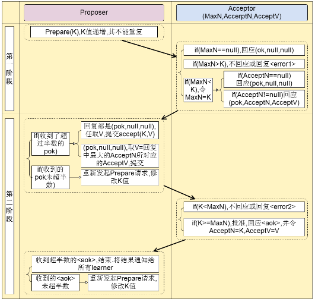
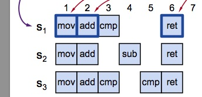
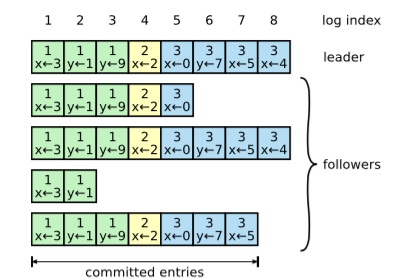

【先记录，后整理，这里是先记录】

# primary-backup 和 state machine replication 的区别

A state machine is a software component that processes a sequence of requests. For every processed request, it can modify its internal state and produce a reply. A state machine is deterministic in the sense that, given two runs where it receives the same sequence of requests, it always makes the same internal state transitions and produces the same replies.

A state machine replication system is a client-sever system ensuring that each state machine replica executes the same sequence of client requests, even if these requests are submitted concurrently by clients and received in different orders by the replicas. Replicas agree on the execution order of client requests using a consensus algorithm like Paxos. Client requests that are sent concurrently and overlap in time can be executed in any order. If a leader fails, a new leader that executes recovery is free to arbitrarily reorder any uncommitted request since it is not yet completed.

In the case of primary-backup systems, such as Zookeeper, replicas agree on the application order of incremental (delta) state updates, which are generated by a primary replica and sent to its followers. Unlike client requests, state updates must be applied in the exact original generation order of the primary, starting from the original initial state of the primary. If a primary fails, a new primary that executes recovery cannot arbitrarily reorder uncommitted state updates, or apply them starting from a different initial state.

In conclusion, agreement on state updates (for primary-backup systems) requires stricter ordering guarantees than agreement on client requests (for state machine replication systems).

> 最后这段英文说的很清楚了两者的区别，
> agreement on state updates (for primary-backup systems)；
> agreement on client requests (for state machine replication systems)。 

**翻译如下：**

状态机是处理一系列请求的软件组件。对于每个处理的请求，它可以修改其内部状态并产生回复。状态机是确定性的，在给定两次运行的情况下，它接收到相同的请求序列，它总是进行相同的内部状态转换并产生相同的回复。

状态机复制系统是一个 C/S 系统，可确保每个状态机副本执行相同的客户端请求序列，即使这些请求是由客户端并发提交并由副本按不同顺序接收的。副本使用像 Paxos 这样的共识算法就客户端请求的执行顺序达成一致。并发发送并且时间重叠的请求可以以任何顺序执行。如果 Leader 宕机，执行恢复的新 Leader 可以自由地对任何未提交的请求重新排序，因为它尚未完成。

对于主备备份系统（如 Zookeeper），副本同意增量（增量）状态更新的应用顺序，增量状态更新由主副本生成并发送给其 Follower。与客户端请求不同，状态更新必须从主服务器的初始初始状态开始，以主服务器的确切初始生成顺序应用。如果主节点发生故障，执行恢复的新主节点不能任意重新排序未提交的状态更新，或者从不同的初始状态开始应用它们。

总之，关于状态更新的协议（对于主备备份系统）需要比客户端请求（针对状态机复制系统）的协议更严格的命令保证。

**深入：**

What are the implications for agreement algorithms?
Paxos can be used for primary-backup replication by letting the primary be the leader. The problem with Paxos is that, if a primary concurrently proposes multiple state updates and fails, the new primary may apply uncommitted updates in an incorrect order. An example is presented in the DSN 2011 paper (Figure below). In the example, a replica should only apply the state update B after applying A. The example shows that, using Paxos, a new primary and its follows may apply B after C, reaching an incorrect state that has not been reached by any of the previous primaries.

A workaround to this problem using Paxos is to sequentially agree on state updates: a primary proposes a state update only after it commits all previous state updates. Since there is at most one uncommitted update at a time, a new primary cannot incorrectly reorder updates. This approach, however, results in poor performance.

Zab does not need this workaround. Zab replicas can concurrently agree on the order of multiple state updates without harming correctness. This is achieved by adding one more synchronization phase during recovery compared to Paxos, and by using a different numbering of instances based on zxids.

 

## 换个方式理解

对比主要来自 raft 作者的 phd 论文里面的观点:

 

从这个图可以看出 primary backup system 的做法是, 当有 client 请求到达的时候, primary 会立刻将这个请求 apply 到自己的 state machine, 然后将这个 **结果** (而不是这个 client 的 **请求** ) 发送给自己的 backup。
比如这里就是将 y=2 发送给 backup, 而不是发送 y++ 这个操作，这里发送给自己多个 backups 的时候是通过一致性协议来进行发送。

这里还是有几个要注意的地方，
1. 在 primary backup system 里面, primary 在接收到 client 的请求以后, 会立刻 apply 到自己的 state machine、计算出这个结果、写到自己的 log，以及发送给所有的 backups。 而在 state machine replication 系统里面，是直接将这个操作发送给各个 replication 的。那么带来的两个结果
	- 如果某一个操作最后并没有提交, 那么这个state machine 必须将这次的操作给回滚掉
	- 如果一个新的节点成为primary, 那么旧的primary 的state machine 必须将最近的未提交的操作给回滚掉
	> 可以看出 zab 怎么解决这个问题的呢? zab 的解决方法就是当 recovery 的时候, 将 leader 上面的所有日志都拉去过来, 然后丢弃自己 state machine 的内容, 直接使用新 leader state machine 的内容。
2. primary backup system 里面，log 只需要保存对 state machine 有修改的操作，而 state machine replication 需要记录所有的操作。
	> 比如如果某一次操作 set y = 2，而其实 y 在 DB 里面就是 2，那么在 primary backup system 里面，就不会给 replication 发送这个操作。而在 state machine replication 里面则会发送这个操作，这样带来的影响是可能 state machine replication 会有较多的log，但是通过 log compaction 其实带来的影响可以忽略。
3. state machine replication 需要保证每一个操作都是确定性的，因为每一个 server 都必须保证apply 这一系列的 client 操作以后，所有 server 的结果必须是一样的。因此想比如跟时间，random 相关的这些不确定性操作在这里就无法实现，而在 primary back system 里面，这些不确定性的操作会通过apply 到 state machine 转化成确定性的操作，所以不会有这个问题。因此常见的 state machine replication 会将这些不确定性的操作给拒绝来解决这个问题。也就是 client 请求的时候就必须保证这些操作是确定性的。

在 `Vive La Diffe ́rence:Paxos vs. Viewstamped Replication vs. Zab` 这个论文里面，state machine replication 也称作 `active replication`，而 primary-backup system 也称作 `passive replication`。
这样更加的形象，也就是 state machine replication 是 **主动** 去同步数据，通过达成一致性协议来返回给clien；而 primary-backup system 是 primary 做了所有了事情, 只是通过一致性协议把数据保存在 backups 里面。

放一个大名鼎鼎的图说明问题，

 

> 在 zookeeper 的 wiki 上面同样有 state machine replication 和 primary backup system 的对比，不过感觉他主要想表达的是通过 multi-paxos 实现的 state machine replication 是无法满足有序提交这个问题的。但是其实在 raft 实现的 state machine replication 里面是可以满足这个条件的。所以是否满足有序提交这个问题更多的如上图所示是支持不支持 primary-order 的问题。

# 学习 paxos 之前，需要先学习 RSM。

RSM: Replicated State Machines。最早提出是在Leslie Lamport的著名论文"Time, clocks, and the ordering of events in a distributed system(1978)"论文中，比较系统性的阐述是在Fred Schneider的论文"Implementing fault-tolerant services using the state machine approach(1990)"中。

下面用两种阐释

第一种阐释（中文）：

它的基本思想是一个分布式的RSM系统由很多个replica组成，每个replica是一个状态机，它的状态保存在一组状态变量中。状态机的状态通过并且只能通过外部命令（commands)来改变。比如你可以把MySQL服务器想像成一个状态机。它每接收到一条带修改功能的SQL语句（比如update/insert)就会改变它的状态。一组配置好replication的MySQL servers就是典型的RSM。
RSM能够工作基于这样的假设：**如果一些状态机具有相同的初始状态，并且他们接收到的命令也相同，处理这些命令的顺序也相同，那么它们处理完这些命令后的状态也应该相同。** 因为replica都具有相同的状态，所以坏掉任何一个也没有关系。有了RSM之后理论上可以做到永远不会因为机器的物理故障而丢失数据。实际上，这就是做梦啊！
像Paxos这样的分布式选举协议是实现RSM系统的常见手段。**它的想法是**，这个RSM系统有一个全局的线性增长的日志，记录着它所收到的每条命令。利用分布式选举协议来决定每条命令在这个日志中的index（即先后顺序）。

>  换个英文解释：A state machine is deterministic in the sense that, given two runs where it receives the same sequence of requests, it always makes the same internal state transitions and produces the same replies.

第二种阐释（英文，来自[维基百科](https://en.wikipedia.org/wiki/State_machine_replication)）：

In computer science, `state machine replication` or `state machine approach` is a **general method** for implementing a fault-tolerant service by replicating servers and coordinating client interactions with server replicas. 

> 小结：几个注意点
> 1. RSM 是一种通用方法（general method）；
> 2. RSM 和 Paxos 的关系：RSM 是实现分布式一致性的一种手法(类比：像 C++ 这种手动管理资源的语言，实现资源管理有很多种方法，其中有种方法叫做 RAII，RAII 是一种实现资源管理的方法。这里RSM 类比 RAII，分布式一致性类比资源管理)，而一致性协议 paxos 是用来实现 RSM 的，或者说是 RSM 的一种上层实现（一致性协议是 RSM 的基础，英文原文是 Consensus protocols are the basis for the state machine replication approach to distributed computing, as suggested by Leslie Lamport and surveyed by Fred Schneider，该英文来自 [paxos 的维基百科](https://en.wikipedia.org/wiki/Paxos_(computer_science)).）
> 3. 命令在状态机上的执行顺序并不一定等同于命令的发出顺序或接收顺序。RSM 只是保证所有的状态机都以同样的顺序执行这些命令，并没有要求这些命令的到达顺序。
> 

另外，还有一些点需要注意：
1. paxos 是一组协议，不是一个协议
2. paxos 协议需要权衡很多东西，不同的权衡策略构成了具体的不同的协议，例如 basic-paxos，muti-paxos 等等
	> The Paxos family of protocols includes a spectrum of trade-offs between the  number of processors, number of message delays before learning the agreed value, the activity level of individual participants, number of messages sent, and types of failures.
3. Although no deterministic fault-tolerant consensus protocol can guarantee progress in an asynchronous network, Paxos guarantees safety (consistency), and the conditions that could prevent it from making progress are difficult to provoke.

# Paxos 的角色需要哪些功能

计算机中的问题都来自生活，所以要先看生活中的例子。

例如一个吃饭的例子，

每天上班中午吃什么是一个世界性难题，然而这个问题非常符合Paxos协议的前提：

- 中午吃饭通常都是几个人结伴进行，最终需要共同达成一致去一家餐厅用餐；
- 大家可能结合今天自身偏好有不同的提议；
- 为了避免选择困难症及节省时间（因为实在是每天中午都为这个事情头疼），在最终投票上愿意妥协以快速达成一致。
- 

除此之外，其实Paxos协议还有其他一直必要前提，如参与者至少3人、必须是奇数个等等，这些将循序渐进说明。

**构成**
假设一开始只有一个四人结伴用餐的小团体，有A、B、C、D四位君
A、B想吃拉面，C、D想吃盖饭。好了，愉快的解散……（偶数参与者最终很难遵循少数服从多数原则达成一致，这就是为什么必须是奇数参与者）
为了避免散伙，四位君苦口婆心终于拉拢了E君加入饭团，至此有5位小伙伴A、B、C、D、E参与

**拒绝**
A说：我想吃汉堡王。BDE说：好啊好啊，走！
C说：汉堡王有什么好吃的，去吃盖饭吧。BD说：好啊好啊，走！
E说：盖饭地沟油，咱们还是去吃川菜吧！ABD说：好啊好啊，走！
……（再一次即将面临散伙）
如果BD学会了拒绝呢？

**妥协**
A说：我想吃汉堡王。BDE说：好啊好啊，走！
C说：汉堡王有什么好吃的，去吃盖饭吧。BDE说：算了，跟A去吃汉堡王吧！
C说：我就是不去，你们去吧！
……（还是面临散伙）
如果C学会了妥协呢？

以上三个场景都不是Paxos协议的完整思路，只是大致描述了Paxos协议完善的过程。其协议本身在论证的过程中，也是通过不断的补充及丰富协议来避免冲突。其中Paxos的三个关键词就是**构成、拒绝、妥协**

# Paxos 角色区分

Paxos协议的完成需要区分多种角色：

提议者（Proposer） - 有主见，提议的人。
接受者（Acceptor） - 听取其他人意见，做出决策的人。
执行者（Executor） - 达成一致后，最终执行的人。

在整个协议的过程中，允许一人身兼多职，如A-E五个人，他们每人就可以同时具备上述三种角色。当一个人的提议，被所有决策者中超过半数的人接受之后，那么即认定这个提议为最终提议。在上述5人饭团中，如果一个提议想被接纳，至少需要3人接受这个提议。
如果同时有两个竞争提议Proposal-A和Proposal-E存在，考虑最小多数派：Proposal-A需要A、B、C三人接受，Proposal-E需要C、D、E三人接受。然而C只能最终接受一个提议，因此C需要拒绝其中一个，从而达成多数。

Paxos整个协议过程分为两个阶段：提议阶段和决定阶段，同时为了避免因为信息先后到达的时序性问题，每个提议者在提议和决策时需要申请一个全局递增的序号N。

**提议阶段各角色职责**：

提议者：
携带序号N向超过多数的接受者发起提议（此阶段可提供就餐地点，也可不提供）

接受者：
接收来自各方的提议，如果提议的序号N大于已接受的提议序号，则接受该提议，同时将之前已接受的提议反馈给提议者，并承诺不会再接受序号小于N的提议；
如果提议的序号N小于已接受的提议序号，则拒绝。

**决定阶段各角色职责**：

提议者：
未接收到超过半数接受者的反馈，则询问更多其他接受者；
提议阶段被超过半数接受者拒绝，重新申请新编号，发起提议；
提议阶段被超过半数接受者接受，如果反馈内容中包含其他提议，则自己妥协，将反馈内容中序号最大的提议作为自己的提议，否则使用自己的提议并携带编号N发起决策请求。

接受者：
接收来自提议者的决策请求，如果编号大于或等于自身持有编号，则接受决策；
如果编号小于自身持有编号，则拒绝决策。

执行者：
超过半数接受者做出决策，则执行该提议。

## paxos 一些变种
最出名的变种就是 basic-paxos 和 multi- paxos。

### basic-paxos
下面内容转载自这篇博客 https://www.cnblogs.com/study-everyday/p/7279829.html

假设有Server1，Server2， Server3三个服务器，他们都想通过Paxos协议，让所有人答成一致他们是leader，这些Server都是Proposer角色，他们的提案的值就是他们自己server的名字。他们要获取Acceptor1~3这三个成员同意。首先Server2发起一个提案【1】,也就是说ProposeID为1，接下来Server1发起来一个提案【2】,Server3发起一个提案【3】.

首先是Prepare阶段：
假设这时Server1发送的消息先到达acceptor1和acceptor2，它们都没有接收过请求，所以接收该请求并返回【2，null】给Server1，同时承诺不再接受编号小于2的请求； 
  紧接着，Server2的消息到达acceptor2和acceptor3，acceptor3没有接受过请求，所以返回proposer2 【1，null】，并承诺不再接受编号小于1的消息。而acceptor2已经接受Server1的请求并承诺不再接收编号小于2的请求，所以acceptor2拒绝Server2的请求； 
  最后，Server3的消息到达acceptor2和acceptor3，它们都接受过提议，但编号3的消息大于acceptor2已接受的2和acceptor3已接受的1，所以他们都接受该提议，并返回Server3 【3，null】； 
  此时，Server2没有收到过半的回复，所以重新取得编号4，并发送给acceptor2和acceptor3，此时编号4大于它们已接受的提案编号3，所以接受该提案，并返回Server2 【4，null】。

接下来进入Accept阶段，
Server3收到半数以上（2个）的回复，并且返回的value为null，所以，Server3提交了【3，server3】的提案。 
Server1在Prepare阶段也收到过半回复，返回的value为null，所以Server1提交了【2，server1】的提案。 
Server2也收到过半回复，返回的value为null，所以Server2提交了【4，server2】的提案。 
Acceptor1和acceptor2接收到Server1的提案【2，server1】，acceptor1通过该请求，acceptor2承诺不再接受编号小于4的提案，所以拒绝； 
Acceptor2和acceptor3接收到Server2的提案【4，server2】，都通过该提案； 
Acceptor2和acceptor3接收到Server3的提案【3，server3】，它们都承诺不再接受编号小于4的提案，所以都拒绝。 
此时，过半的acceptor（acceptor2和acceptor3）都接受了提案【4，server2】，learner感知到提案的通过，learner开始学习提案，所以server2成为最终的leader。

### multi- paxos
basic-paxos 还是太过于理论，无法直接用到复制状态机中，总的来说，有以下几个原因，
1. Paxos只能确定一个值，无法用做Log的连续复制
2. 由于有多个 Proposer，可能会出现活锁
3. 提案的最终结果可能只有部分 Acceptor 知晓，没法达到复制状态机每个 instance 都必须有完全一致 log 的需求

那么其实 Multi-Paxos，其实就是为了解决上述三个问题，使 Paxos 协议能够实际使用在状态机中。
解决第一个问题：为 Log Entry 每个 index 的值都是用一个独立的 Paxos instance。
解决第二个问题：让一个 Paxos group 中不要有多个 Proposer，在写入时先用 Paxos 协议选出一个 leader，然后之后只由这个 leader 做写入，就可以避免活锁问题。（并且，有了单一的leader之后，我们还可以省略掉大部分的prepare过程。只需要在leader当选后做一次prepare，所有Acceptor都没有接受过其他Leader的prepare请求，那每次写入，都可以直接进行Accept，除非有Acceptor拒绝，这说明有新的leader在写入）。
解决第三个问题：Multi-Paxos给每个Server引入了一个firstUnchosenIndex，让leader能够向向每个Acceptor同步被选中的值。
解决这些问题之后Paxos就可以用于实际工程了。

# ZAB
ZAB随着Zookeeper诞生于2007年，此时Raft协议还没有发明，根据ZAB的论文，之所以Zookeeper没有直接使用Paxos而是自己造轮子，是因为他们认为Paxos并不能满足他们的要求。比如Paxos允许多个proposer，可能会造成客户端提交的多个命令没法按照FIFO次序执行。同时在恢复过程中，有一些follower的数据不全。这些断论都是基于最原始的Paxos协议的，实际上后来一些Paxos的变种，比如Multi-Paxos已经解决了这些问题。当然我们只能站在历史的角度去看待这个问题，由于当时的Paxos并不能很好的解决这些问题，因此Zookeeper的开发者创造了一个新的一致性协议ZAB。（但其实心里要明白它们其实是一回事。）

# Raft

Raft 的论文写得非常非常清楚，建议直接看论文了。

# 对比一些细节

## multi-paxos 和 Raft
multi-paxos在选定了leder后的行为和raft一模一样，除了两点：
1. raft仅允许日志最多的节点当选为leader，而multi-paxos则相反，任意节点都可以当选leader
2. raft不允许日志的空洞，这也是为了比较方便和拉平两个节点的日志方便，而multi-paxos则允许日志出现空洞
如图，multi-paxos日志中间允许出现空洞，而multi-paxos的leader节点也会异步的查询其他节点来填补自身日志空洞

如图，raft的典型日志，可以看到raft执行过程中是不会产生空洞的

总结一下：
1. multi-paxos的leader只是知道最大的log index是多少，但是空洞部分，可以异步填充。
2. raft的leader，不但知道最大的 log-index 是多少，也必须拥有从0到log index之间的全部日志。

# 最后

ZK 论文：http://www.tcs.hut.fi/Studies/T-79.5001/reports/2012-deSouzaMedeiros.pdf （ZooKeeper’s atomic broadcast protocol:
Theory and practice
Andr´e Medeiros
March 20, 2012）

三者对比：https://blog.csdn.net/wuhuaiyu/article/details/72331850
*   paxos文章：[http://blog.csdn.net/wuhuaiyu/article/details/72329397](http://blog.csdn.net/wuhuaiyu/article/details/72329397) 翻译的  paxos made simple
*   zab文章：[http://blog.jobbole.com/104985/](http://blog.jobbole.com/104985/) 文章亮点：详细给出状态转移图
*   raft文章：[http://www.cnblogs.com/mindwind/p/5231986.html](http://www.cnblogs.com/mindwind/p/5231986.html) 文章亮点：列举了所有的异常恢复情况

