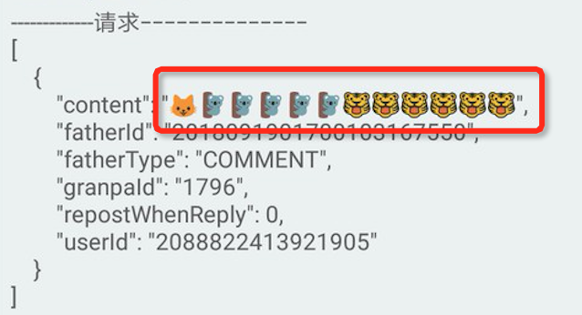
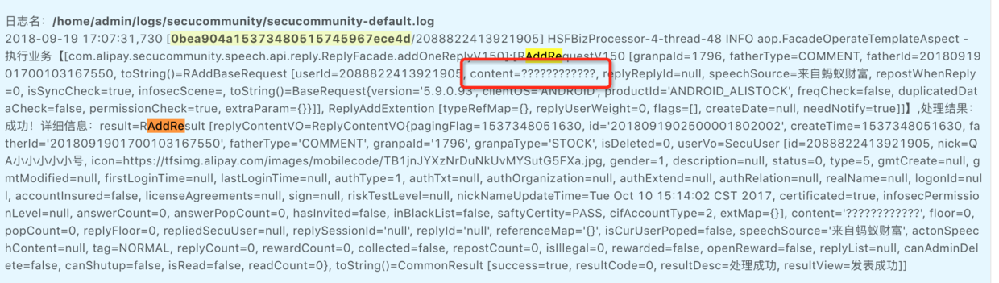
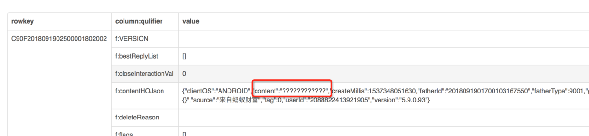
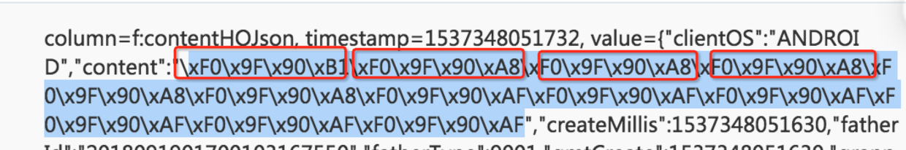

# 问题背景

C 端可以发表情、正常显示表情；
B 端可以发表情，但是无法正常显示表情。

# 问题排查

首先是 C 端发表情，如下，这说明 C 端可以正常发、正常收，数据和编码应该是没问题的，

然后想看看传过来的参数具体是什么，于是查下入参 log，如下，

由这里的 log 可知，入参显示成问号。接着看看数据库里面是什么，

这里也显示成了问号。
> HBase 中存的都是字节型数据，这里的显示做了解码。

综合目前三点来看，就有点奇怪了：难道传进来的是乱码？但是 C 端是正常的，说明数据和编码不会有问题。但是现在的情况来看，数据确实是“问号”。

这时候想到会不会是浏览器显示的编码问题，于是去库里看看 HBase 的 字节型 数据存的到底是什么，

对照第一张图，发现存的数据是吻合的！

那么这时候基本可以得出来结论，浏览器上的（C 端、log 页面、HBase 解码页面）都不正常！

# 问题解决

B 端换字体样式，需要一个支持表情的字体，该问题即可修复。

# 问题分析

参照上面最后一张图，表情是 4 字节 utf8 数据，而汉字是 3 字节，所以 decode 时如果前端不支持 utf8 表情的解析，就会出问题。

