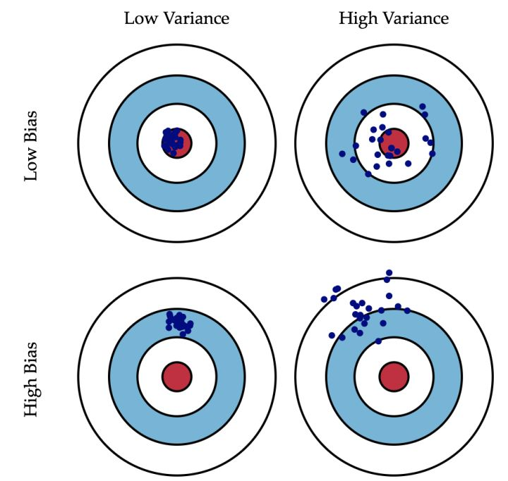
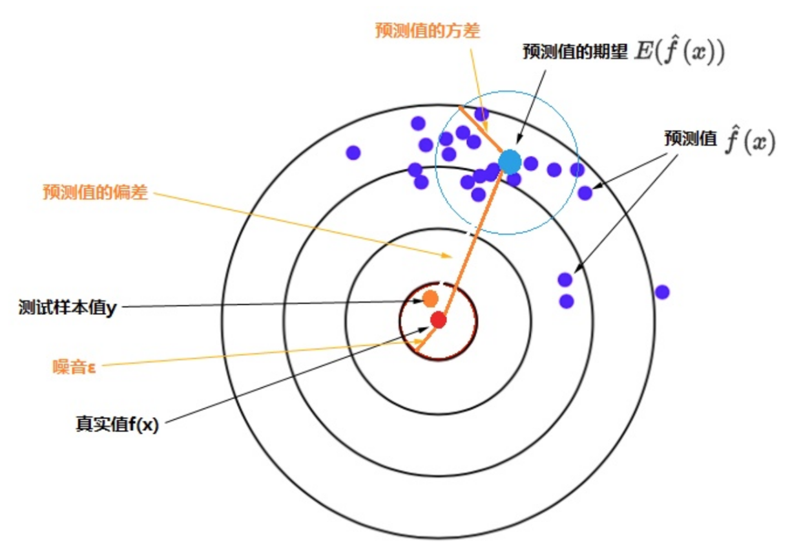
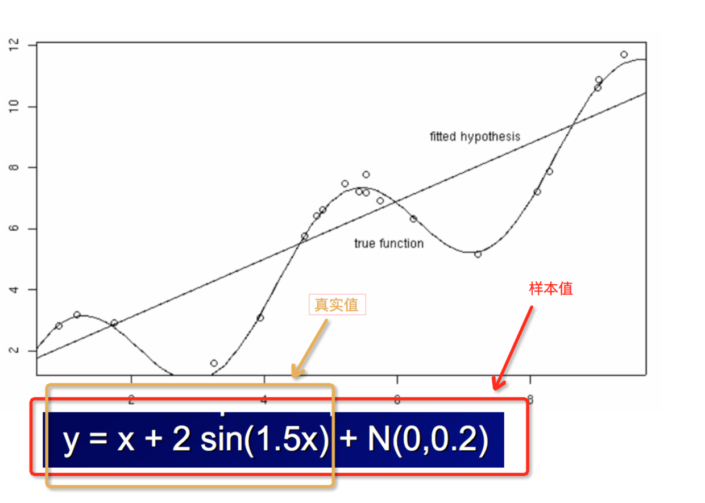
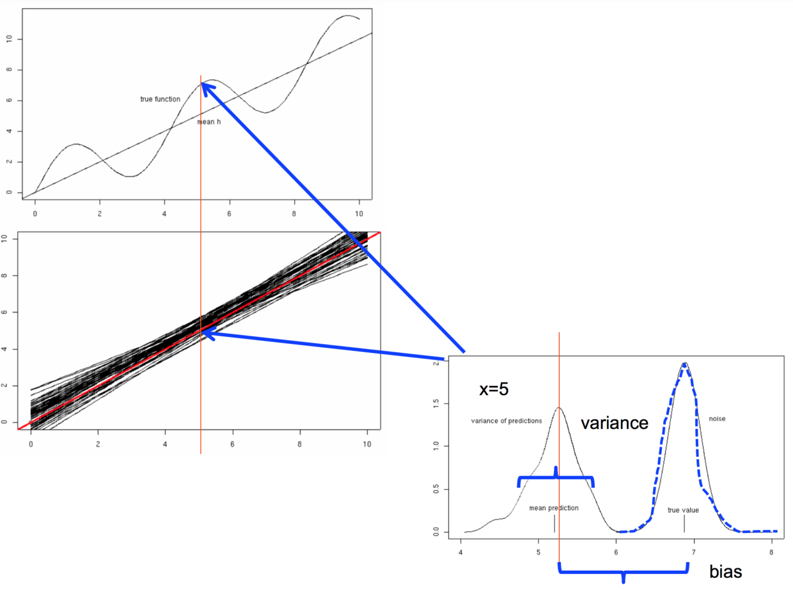

感觉通过中文字面来理解会很容易造成误解，建议用英文来理解。
偏差：bias
方差：varience

# 形象理解，快速入门

用打靶来解释，bias 描述的是瞄得准不准；varience 描述的是手稳不稳。
1. 光瞄得准没用，如果手抖，那么打出去的子弹会分散。这种情况也就是 low-bias、high-varience；
2. 同理，光手稳也没用，如果瞄的不准，打出去的子弹就不在靶心。这种情况也就是 high-bias、low-varience。

放两张图（图片来自网络），一图胜千言，

# 结合图示，理解概念

在机器学习中考察偏差和方差，最重要的是（**划重点**），
1. 在不同数据集上训练出一组具体的模型
2. 这些模型对一个测试样本进行预测
3. 考察这一组预测值的方差和偏差
4. 这一组预测值的方差和偏差，作为模型的方差和偏差

## 结合一个例子

现在我们用线性函数来构建模型，训练样本来自随机采集的一组 y，经过多次重复，可以得到一系列具体的线性模型，如下图中那一组聚集在一起的黑色直线所示，其中间有一条红色线是这一组线性函数的平均（期望值）。这就是特定模型（线性函数）在同样条件下（每次取20个样本点）重复多次（得到50个线性函数）。
根据生成的50个具体的线性函数来考察该线性模型的预测性能，选取一个样本点，比如选择 x=5 时（下图中红色竖线位置），真实值 f(x) = 6.876，样本值 y 约等于 6.876，y 与 f(x) 的偏差体现在图片右下方的噪音（noise） 部分。红色线性函数在 x=5 位置的值是这50个线性函数在该位置的期望值，黑色直线在 x=5 位置的一系列值的分布则反映了它们的方差（Variance）。50个预测的期望值与真实值 f(x) 之间的距离体现了偏差（Bias）。（参考下图右下部分的 variance 和 bias）。

## 参考资料
https://zhuanlan.zhihu.com/p/44872686
[http://www.cs.cmu.edu/~wcohen/10-601/bias-variance.pdf](http://www.cs.cmu.edu/~wcohen/10-601/bias-variance.pdf)

# 形而上理解一

文字进行的形象描述，能帮助理解，但是肯定不够准确的。因为在准确描述世界规律这件事情上，数学要比任何文字准确、严谨、无歧义得多。

但是纯数学上面理解由比较枯燥、还可能难理解。所以这里从数学的应用角度，即 ML 角度来帮助进阶理解。

bias：样本拟合出的模型的 **预测结果** 的期望与 **真实值** 之间的差距。
varience：**模型预测值** 的一系列值的方差（离散程度）。

因此，
1. 要想在 bias 上表现好，即得到 low-bias，就得复杂化模型，例如增加模型参数。但是这样容易造成过拟合。过拟合后会造成 high-varience，对应图中的第一列，点很分散。
2. 要想在 varience 上表现好，即得到 low-varience，就要简化模型，但是模型太简化容易造成欠拟合，对应图中的第二行，预测值偏离”靶心“。

# 形而上理解二

如果这样仍然不太懂，还可以再换个角度。把上面图中靶子上面的点想象出一个个的模型，
1. 如果模型都聚成一堆，位置还比较偏（对应上面图中左下角）。那么任何数据灌进来，拟合的模型都差不多。这说明这模型太过简陋了，姿势水平比较低，没见过世面一样，这就是欠拟合。
2. 如果模型围绕靶心均匀分布，但是不够集中、比较散（对应上面图中右上角）。那么一有新数据进来，就会剧烈动荡。这说明模型过度设计了，太过复杂和精细，一点不规律的扰动就会破坏原本的设计，这就是过拟合。

# 形而上理解三

除此之外，林轩田老师的机器学习技法里面，也有讲过这个问题，也能方便理解。

先回顾一下训练模型的过程和目的。我们通过训练集训练出模型，然后用测试集来测试模型效果如何，我们期望的是在测试集上的预测误差尽可能地小，即 Error(test) 尽可能小。那么通过什么方式来减小 Error(test) 呢（实际问题中，test 数据是拿不到的，也不知道 test 数据的内在规律和分布等信息）？

方法就是，
1. 让 Error(train) 尽可能小；
2. 让 Error(train) 尽可能等于 Error(test)。
> 这个也很好理解，a 很小，a=b，那么 b 也很小。

Q：那么怎么让 Error(train) 尽可能小呢？
A：把模型搞复杂。

Q：怎么让 Error(train) 尽可能等于 Error(test) 呢？
A：把模型搞简单，使模型泛化性好。模型越简单、泛化越好，就越对 train 和 test 一视同仁，也就达到了 Error(train) 尽可能等于 Error(test) 的目的。

