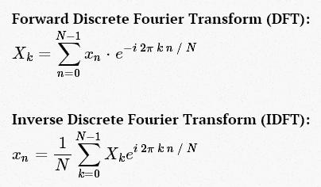

# 学校里面教的

学校里面基本都是说是把时域变换到频域等等，然后给一个公式，

然后当时虽然尽力在理解，但是仔细想起来，死记硬背的成分也不少。
不信让毕业几年、且没有用 DFT 的人再讲这个，有几个人能讲清楚？大多数都忘记了。
当时记得，现在忘了，只有一种解释，那就是当时没理解。

# 换个角度

其实换个角度理解很简单，上图那个式子是序列形式、是离散的，处理离散数据经常用矩阵处理，其实写成矩阵，矩阵论学得好的肯定一下就理解了，


其中，矩阵 M 表示为


写到这里基本都看明白了，没看明白的需要补一下矩阵论的知识。
这其实就是个普通的矩阵变化而已。

写成代码就更清楚了，

```python
import numpy as np
def DFT(x):
    """Compute the discrete Fourier Transform of the 1D array x"""
    x = np.asarray(x, dtype=float)
    N = x.shape[0]
    n = np.arange(N)
    k = n.reshape((N, 1))
    M = np.exp(-2j * np.pi * k * n / N)
    return np.dot(M, x)
```

