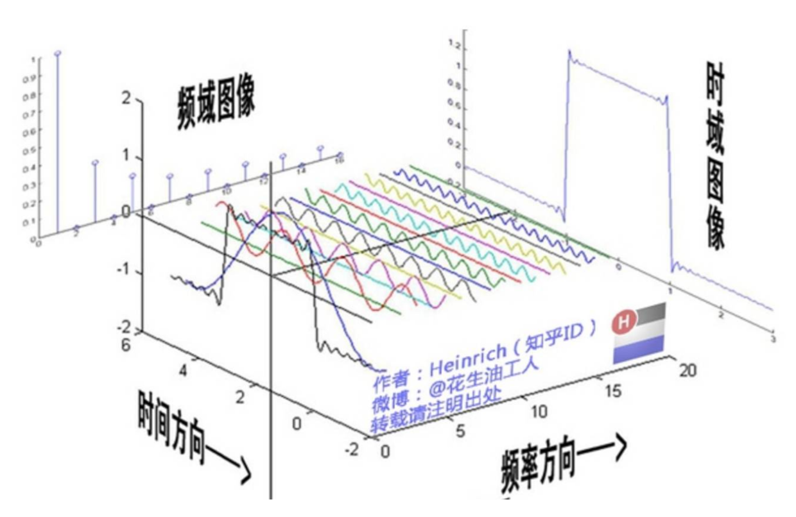

> 出处见图中水印。

这张图画的很好，时域图像是一个典型的一维信号——一个近似的方形波，它是由一系列正弦信号叠加而成(余弦信号是正弦信号相移产生，所以是广泛意义上的正弦信号)。

http://www.10tiao.com/html/506/201708/2651615525/1.html  理解图像的时域、频域

https://www.zhihu.com/question/20500497    细读 中微子 的回答，理解为什么卷积需要翻转。
> 注意：翻转了，是卷积运算；不翻转，是相关运算。

https://blog.csdn.net/bitcarmanlee/article/details/54729807   理解 “卷积可以被看作是滑动平均的推广” ，或者说“卷积可以理解为不同位置的加权叠加”。

个人认为，理解了上面三点，卷积就理解透彻了。

