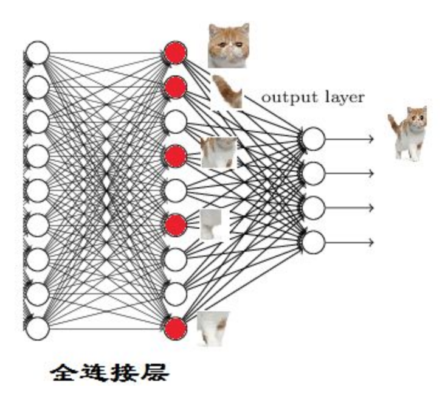
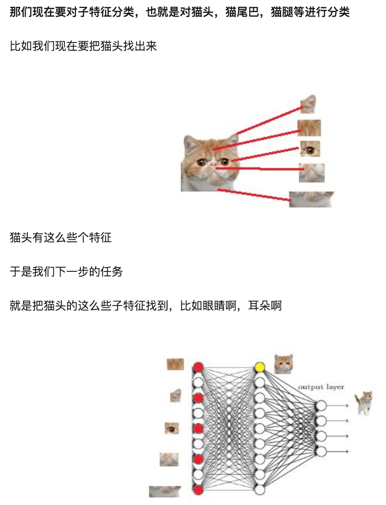

# 一、FC 层的作用

简单来说，以 CNN 为例，FC 层之前的层的作用一般是提取特征，FC 层的作用是分类。原始数据经过卷积层、池化层、激活函数层之后，会被映射到隐层特征空间，全连接层将再隐层特征映射到样本标记空间。
> 因为卷积取的是局部特征，FC 把局部特征通过权重矩阵组装成完整的图。因为用到了所有的局部特征，所以叫全连接。

换一种表述，全连接将 **隐含层特征** 进行 **显示表达**，原始特征被映射到隐层特征空间后，FC 层用 **分类** 的方式，将其显示地表达出来。

还可以从数学的角度讲，全连接就是个矩阵乘法，相当于一个特征空间变换，把前面的层提取的特征整合。也可以理解为，把特征从高维变到低维，同时将有用的信息保留下来。

另外，摘自知乎大佬的回答加深理解，

“假设你是一只小蚂蚁，你的任务是找小面包。你的视野还比较窄，只能看到很小一片区域。当你找到一片小面包之后，你不知道你找到的是不是全部的小面包，所以你们全部的蚂蚁开了个会，把所有的小面包都拿出来分享了。全连接层就是这个蚂蚁大会~如果提前告诉你全世界就只有一块小面包，你找到之后也就掌握了全部的信息，这种情况下也就没必要引入fc层了”

> 作者：田star
> 链接：https://www.zhihu.com/question/41037974/answer/150552142
> 来源：知乎
> 著作权归作者所有。商业转载请联系作者获得授权，非商业转载请注明出处。

全连接的本质是将输入向量的所有元素进行加权求和。

# 二、为什么大部分是两层以上的 FC 

下面内容也整理自知乎大佬的回答，可以去链接进去看原回答，写得很赞。

就像泰勒公式一样，泰勒公式利用多项式去拟合光滑的函数。用这个类比，一层 FC 中的一个神经元相当于一个多项式函数，一层 FC 相当于用许多神经元去拟合目标函数。但是只用 一层 FC 有时候没办法解决非线性问题，因此需要至少两层。

一层 FC，可以用下图来理解，

两层 FC，可以用下图来理解，

> 作者：蒋竺波
> 链接：https://www.zhihu.com/question/41037974/answer/320267531
> 来源：知乎
> 著作权归作者所有。商业转载请联系作者获得授权，非商业转载请注明出处。

