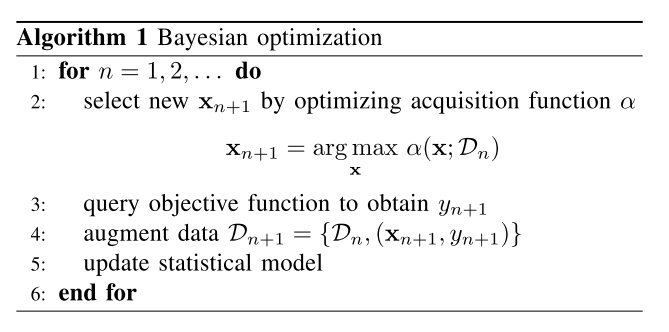
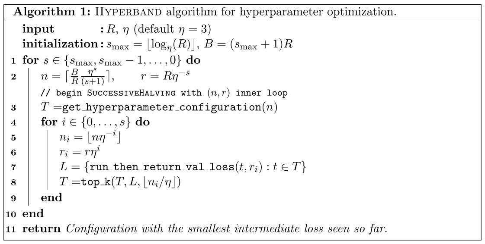

# 超参寻优介绍

超参优化问题看作是一个臂数量无限的多臂赌博机问题，每个臂代表的参数都是采样得到的。业内一些的方法有：
- 手动调。传统调参方式。
- 网格寻优。
- 随机寻优。
- 基于梯度优化。目标函数得是凸函数，且曲面光滑可导。
- 基于进化算法。例如遗传算法、蚁群算法等。
- 基于贝叶斯寻优。能充分利用已有的信息。

机器学习模型超参调优一般有两个特点。一方面，不一定能够较方便的获取到模型训练过程想要的梯度信息；另一方面，不能假设模型超参数和最终指标符合凸优化条件（否则的话通过求导或者凸优化方法就可以求导最优解）。基于此，业内常用的方法是贝叶斯寻优。贝叶斯调优是一种黑盒方法，只看到模型的输入和输出。

用数学语言来描述的话，超参寻优就是求 x = argmax_x f(x)，其中 f(x) 未知，且一般为非凸函数。

# 贝叶斯方法

## 名词解释

目标函数。超参数的实际联合分布曲线（或曲面），一般是非凸的。
代理模型。经过几次尝试后，仅知道目标函数在几个点上的真实值，代理模型用来确定目标函数在其他地方的取值。
预算。每一个位置点上探索尝试的代价。
采集函数。用来评估每一位置点的价值，来确定下一个采样点的函数。可以类比强化学习的 reward。

## 整体过程

这段英文描述的非常到位准确：It attempts to find the maximum value of an unknown function in as few iterations as possible. This technique is particularly suited for optimization of high cost functions, situations where the balance between exploration and exploitation is important.

贝叶斯优化超参的整体过程可以想象为：超参数的实际联合分布是一条非凸的曲线（或曲面），现在希望通过尽量少的尝试次数，找到这条曲线的最大值。
因为对曲线的分布一无所知，但可以通过在不同位置点上探索尝试来了解其分布，然而这种探索的成本非常高的。因此既希望最大程度地减少探索次数，同时又能快速地找到最大值的位置。
从这个角度看，贝叶斯优化可以看做一个两阶段任务，
第一阶段：主动探索阶段，在不同的位置点上进行探索尝试，以更好地估计目标函数的真实分布。
第二阶段：贝叶斯寻优阶段，根据目前所知道的，接下来应该评估哪一个点？

## 主动探索
标记通常要花费很多精力，在有些问题中，标记的代价甚至会非常的高。
主动学习可最大程度地减少标记的成本，同时尽可能提高建模精度。由于仅知道目标函数在几个点上的真实值，因此需要一个代理模型来确定函数在其他地方的取值，该代理模型需要能足够灵活以对真实函数进行建模。业内一般使用高斯过程作为代理模型，这既因为它具有灵活性，又可以为提供不确定性的估计。

## 贝叶斯优化
可以通过不断地主动学习，探索尝试足够多的点，进而准确估计目标函数，然后找到其最大值，网格寻优和随机寻优等方法就是这么做的。但在仅考虑最大值的情况下，这肯定不是最优解，这是贝叶斯优化的核心问题——根据目前所知道的点，确定接下来应该评估哪一个点。
在贝叶斯优化中，需要权衡探索不确定的区域（以防止陷入局部最优），还是集中于已经知道的较大值附近的区域。这点有点像 MAB 的思想，权衡 explore 和 exploit。贝叶斯优化通过采集函数(acquisition function)来做出此决定。采集函数一般具有如下特点：
1、它们是启发式评估方法；
2、它们是替代后验的函数；
3、它们将 explore 与 exploit 结合起来；
4、它们的评估代价不高。

算法的流程大致如下：
1、首先选择一个代理模型来对真实函数建模并定义其先验。
2、给定一组观察值（函数评估），使用贝叶斯规则获取后验。
3、用采集函数a(x)，它是后验的一个函数，来确定下一个采样点 x_t = argmax_x a(x)
4、将新采样的数据添加到观测值集中，然后执行步骤2，直到收敛或用尽预算。

从伪代码中可以看出这其实是一个基于顺序模型的优化方法（SMBO），它一个接一个地运行试验，每次通过应用贝叶斯推理和更新代理模型来尝试更好的超参数。其实就是建立代理模型的目标函数，包含一个先验函数（Prior Function），然后根据采集函数找到在代理模型上表现最佳的超参数，将这些超参数应用于真正的目标函数，更新包含新结果的代理模型，不断重复这个过程，直到达到最大迭代次数或时间。

小结一下，贝叶斯优化的两个关键部分：
一、概率代理模型，它包含一个先验分布，它捕获我们对未知目标函数行为的信念，以及一个描述数据生成机制的观察模型。
二、采集函数，它描述了一系列参数选择的优劣。

## 展开来看
代理模型，也可以叫先验函数，或者说先验分布。使用高斯过程是一种常见的选择，因为 GP 可以方便描述多个随机变量的联合分布，它是连续域（例如时间或空间）上函数的分布。它足够简单，可以有均值和协方差函数来表示，又具有灵活性，还可以较方便地为提供不确定性估计。

采集函数，它用于从候选集中选择一个新的点，它需要平衡 explore 和 exploit。不同的平衡策略造就了不同了采集函数，常见的采集函数有，
PI、EI 类，PI 是一个概率函数，因此只考虑了 f(x) 比 f(x') 大的概率，而 EI 则是一个期望函数，因此考虑了 f(x) 比 f(x') 大多少。
置信边界策略类，集成类等，略。都是围绕着 EE 平衡来的，其他方法还有 hyperopt、TPE、SMAC等，就不展开了。

### Hyperband / BOHB
接下来重点看看 hyperband 和 BOHB。
hyperband解决的问题主要是如何加快 random search，方法是通过一个自适应的资源分配机制和 early-stopping 的机制，hyperband是对SuccessiveHalving算法进行了优化。
SuccessiveHalving思想是，假设有n组超参数组合，对这n组超参数均匀地分配预算并进行验证评估，根据验证结果淘汰一半表现差的超参数组，然后重复迭代上述过程直到找到最终的一个最优超参数组合。有点像二分查找的感觉。

SuccessiveHalving 的问题是，它需要总的组合个数 n 来作为输入，这样平均每个组合（configuration）就被分配了 B/n 的预算，这也其实就带来了两个问题：
如果 n 很大，每个 configuration 平均分到的资源太少了，是否足够去 train？
如果 n 很小，每个 configuration 平均分到的资源太多了，是否是一种浪费？
用户需要自己做trade-off来缓解这两个问题。

Hyperband 试图解决这个问题，伪代码如下，

整个 Hyperband 是一个两层循环，内层循环是一次 SuccessiveHalving。
R：单个 configuration 所能分配的最大预算
r：单个 configuration 实际所能分配的预算
s_max：用来控制总预算的大小
B：外层循环每次总共的预算，B=(smax+1)R，一次 Hyperband 花的总时间为 (smax+1)B
η：用于控制每次迭代后淘汰参数设置的比例
get_hyperparameter_configuration(n)：采样得到n组不同的超参数设置，这里使用的是随机均匀采样
run_then_return_val_loss(t, r)：根据指定的参数设置和预算计算loss
top_k(configs, losses, k)：表示需要选择最好的k个configuration

Hyperband 是从 s_max 开始的，可以使 n 最大化 exploration，这样可以保证至少有一个 configuration 用到了 R 资源。之后 n 以 η 作指数衰减，到 s=0 时，每个 configuration 都可以用到 R 资源。每次的inner loop，用于评估的超参数组合数量越来越少，与此同时单个超参数组合能分配的预算也逐渐增加，所以这个过程能更快地找到合适的超参数。

Hyperband 的提出主要是为了解决 Successive 的一个 trade-off 问题，它可以动态的选择一个合适的 configuration 的个数去做 SuccessiveHalving。

Hyperband 是基于随机采样来探索参数组合的，所以它的收敛速度不快。

BOHB 是 Bayes Optimization（BO）和 Hyperband（HB），因此它的大体思想其实就是结合这两个算法。将 BO 结合进 Hyperband 主要是为了让 Hyperband 摆脱参数组合的随机采样，已达到更快的收敛速度。需要注意的是，原论文里作者使用的 BO 方法是基于 TPE 的，并且作者也指出，这里的 TPE 可以很容易的被其他的 GP-based BO 方法所替换。
另外，BOHB 方法还有一个优点，那就是工程实践上可以做到并行，这点就不展开了。

# 实现参考

https://github.com/fmfn/BayesianOptimization

https://github.com/automl/BOAH

https://github.com/automl/HpBandSter

