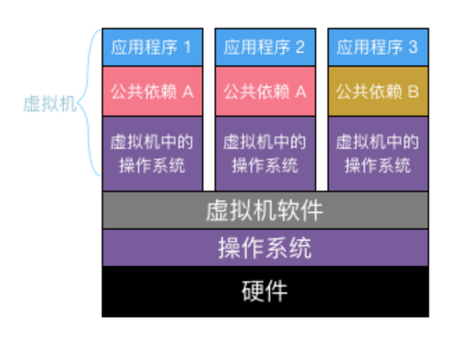
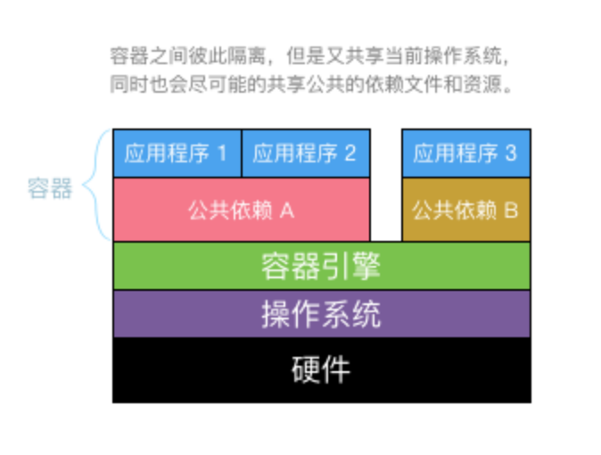

一个 k8s、Docker 盲的学习笔记。
未完待续，持续记录。

# 背景

- 当硬件计算能力变得越来越强时，为了释放人类的计算需求最大化利用硬件计算能力，各种虚拟机得以开发出来，以提高硬件的利用率。
- 当软件存储量和计算量远远超过普通的单台电脑硬件上限时，硬件上就出现了瓶颈，出于成本考虑软件上的“分布式”解决方案得以变得流行。（如果将来的普通硬件计算能力和存储能力提高到某个阀值，也许就不需要复杂的“分布式”技术了）。
- 当互联网软件的业务复杂度越来越高，同时迭代速度变的越来越快，虚拟机对硬件的利用率出现瓶颈，因为虚拟机很难根据当前业务量动态调整其占用的硬件资源，同时虚拟机的开关响应速度跟不上业务快速迭代的节奏，因此容器化技术得以流行。

> - 虚拟机中的操作系统彼此之间的内存和CPU是固定的不可共享的，假设应用程序1和应用程序2占用了大量内存性能下降，但是应用程序3所在的虚拟机有很多内存闲置，然而因为虚拟机的完全隔离性，无法充分的发挥硬件资源的利用率。
> 
> - 另外硬盘上的只读文件(公共依赖)也是不可共享的，虽然这些公共的只读文件永远不会被修改，但是也必须重复的复制到每一个虚拟机里面，最终浪费大量硬件存储资源。

> 容器之间彼此隔离，但是又共享当前操作系统，同时也会尽可能的共享公共的依赖文件和资源。Linux系统内核原生对容器化进行了支持，因此容器的执行不需要额外的虚拟化支持

# 一些能帮助理解的小细节
- Docker这样的容器技术，也是虚拟化技术，属于轻量级的虚拟化。VMware 这种虚拟机虽然可以隔离出很多“子电脑”，但占用空间更大，启动更慢，虚拟机软件本身可能还要花钱。而容器技术恰好没有这些缺点。它不需要虚拟出整个操作系统，只需要虚拟一个小规模的环境（可以理解为“沙箱”）。
- 虚拟化技术依赖的是物理CPU和内存，是硬件级别的；而 Docker 是构建在操作系统层面的，利用操作系统的容器化技术，所以 Docker 同样的可以运行在虚拟机上面。
- Docker 启动时间很快，几秒钟就能完成。而且资源的利用率很高（一台主机可以同时运行几千个Docker容器）。此外，它占的空间很小，虚拟机一般要几GB到几十GB的空间，而容器只需要MB级甚至KB级。
- Docker本身并不是容器，它是创建容器的工具，是应用容器引擎。
- “命名空间”这个概念，隔离了进程、网络、文件系统；“控制组”这个东西，限制了 CPU、内存、磁盘IO 这些资源的使用。
- LXC 是啥？LXC(Linux Containers)基于内核提供的Cgroups与Namespaces技术，LXC项目只是对此做了整合，从而为应用软件构造出一个轻量级的独立的隔离的操作系统环境。
- 既然LXC已经可以实现容器，那么为什么需要 Docker？不严谨的说：LXC=Cgroups+Namespaces；Docker=Cgroups+Namespaces+UnionFS。
- Docker 镜像、容器、仓库。镜像和容器就像面向对象里面的“类”和“实例”的关系。仓库是集中存放镜像文件的场所。
- 在Kubernetes中，应用一般是运行在Pod中的。其他应用如果想访问这个应用，就需要知道应用所在Pod的地址。虽然Pod自身是有IP的，但是Pod并不是稳定的，他有自己的生命周期，随时都有可能被创建或销毁，一旦被销毁，这个IP所代表的应用就不可用了。一般生产环境中，同一个应用出于高性能和高可用方面的考虑，往往会部署多份实例，也就是会有多个Pod运行着这个应用。每个Pod都不稳定，其他系统怎么能知道到底要访问哪个IP呢？既然Pod不稳定，那有没有一个稳定的东西，让依赖这个应用的其他应用统只访问他，而不用关心后端Pod的状态呢？这个东西就是Service。在Kubernetes中，对于逻辑上相关的一组Pod，定义了一个访问这组Pod的入口，其他应用访问固定的Service，Service再通过配置的策略将请求重定向到后端的Pod上。
